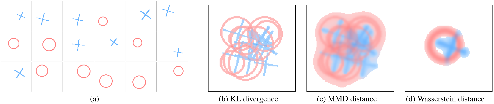
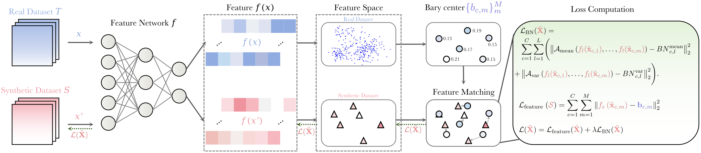
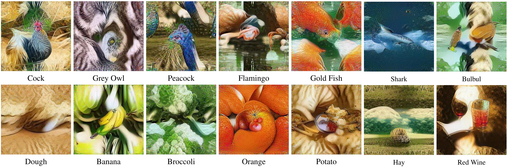
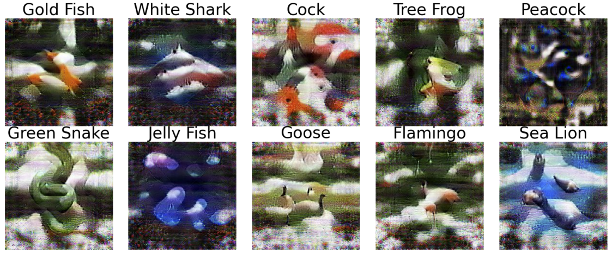

# 少而不失真，且更稳健：数据集蒸馏的两个关键进展

数据集蒸馏（Dataset Distillation，DD）正在成为大模型时代一条务实的“降本增效”路径：用每类极少的合成样本训练出接近使用全量数据的模型，从而显著降低时间、算力与能耗。真正的挑战包括两点：其一，如何在极少的样本中尽可能保留原始数据分布的几何特性；其二，如何在不显著增加成本的情况下，使在 DD 上训练的模型在对抗扰动下仍保持可靠。本文介绍我们近期的两项工作：ICCV 2025 的 WMDD 针对前者，AAAI 2025 的 GUARD 针对后者。

下文分别介绍两项方法的动机、做法与主要结果。

## WMDD：用 Wasserstein 度量保留数据分布的几何特性

> 论文：Dataset Distillation via the Wasserstein Metric（ICCV 2025）｜arXiv：<https://arxiv.org/abs/2311.18531>

数据蒸馏要做的，归根到底是“少而不失真”。WMDD（Wasserstein Metric-based Dataset Distillation）的出发点很直接：既然我们关心分布的几何特性，就用最能保留形状和结构的距离来对齐它——Wasserstein 距离，并以其在几何意义上的“重心”（barycenter）作为蒸馏目标。

最优传输（Optimal Transport, OT）的思想可追溯至法国数学家 Monge，后由 Kantorovich 在二十世纪铸成现代优化理论的重要分支。与之紧密相关的 Wasserstein 距离，距离刻画的是把一个分布搬运成另一个分布所需的最小代价，因此能够保留分布的几何特性。直观地说，如果把数据分布想象成一团可以流动的“质量”，Wasserstein 衡量的是把一团搬运成另一团的最小“功”；它带着几何去对齐每一份质量，而不是只盯住均值或协方差。相应的 Wasserstein 重心，也不是把若干分布简单“糊”在一起，而是找到能同时接近它们的中心形态——在形状上保留各自结构特征。这种“保形”的能力，正是数据蒸馏最需要的。

_图 1  二维玩具分布的“重心”对比：原始分布由圆环（红）与交叉（蓝）两类形状组成，色深表示概率密度、色相区分源分布类型。KL 与 MMD 的重心更像是僵硬的混合；Wasserstein 重心以最小搬运代价在几何上做自然插值，较好保留结构特征。_

WMDD 把合成数据的学习搬到特征空间中：先用在原始数据上训练好的分类器，把每类样本映射到最后一层线性分类器之前的特征空间，再在该空间分别计算各类的 Wasserstein 重心。这里的重心不是一个点，而是一组带权代表点，用尽量少的“锚”概括类内多样性与几何结构。随后，我们用梯度下降优化每类少量合成图像，使其特征贴近对应的重心代表点。同时引入一个简单但关键的正则：按类统计的 BatchNorm 约束（Per-Class BN，PCBN）。不同于以往全局 BN 对齐容易让类别间的梯度相互牵扯，PCBN 在类内对齐各层 BN 的均值与方差，既利用了预训练网络的先验，又不打乱类内结构的学习。为保证可扩展性，我们采用高效的最优传输求解，对重心的“位置—权重”交替优化，计算与存储开销与主流的高效分布匹配式蒸馏方法相当。

_图 2  WMDD 方法流程：真实数据集 T 与合成集 S 先经特征网络 f 获得特征；以真实特征计算按类的 Wasserstein 重心（含位置与权重）；在蒸馏过程中，以“特征匹配损失 + 按类 BN 统计（PCBN）正则”共同优化合成样本，使其对齐重心并生成更具代表性的合成数据。_

不同于传统的基于 MMD 的分布匹配式蒸馏，为什么这套方案能在高分辨率数据集上既可算、又好用？从 Wasserstein 更能捕捉分布几何的角度看，它带来的“搬运”视角会让优化的梯度更有指向性：不是简单拉近某个统计量，而是明确地把合成样本朝真实数据的相应区域推近；而 MMD 的意义严重依赖核的选择与带宽设定，未必能稳定地刻画我们关心的几何关系。另外，从DD算法实际效率的角度，我们在附录中给出了另一种解释：完整的核化 MMD 计算开销随原始数据集的样本量平方增长，很难在 ImageNet-1K 量级上落地。许多基于 MMD 的蒸馏方法为了规模化，退而只对齐特征均值（等同于使用线性核），这在统计上并不能唯一标定分布，往往会忽略高阶差异与几何结构，从而无法给优化提供足够准确的信号。Wasserstein 一方面具有理论保障，即在合理的 Lipschitz 假设下，真实分布与合成分布在期望风险上的差异可以被 W1（Wasserstein-1）距离上界；而另一方面，固定合成样本量下单次OT求解的复杂度只随原始数据样本量线性增长，同时我们可以借助特征空间降维与高效 OT 求解保持可计算性。

实验上，WMDD 在 ImageNette、Tiny-ImageNet 与 ImageNet-1K 三个高分辨率数据集上，1/10/50/100 IPC 的多种预算下都给出了强竞争甚至领先的结果。以 100 IPC 为例，我们在三套数据上的 top-1 分别达到约 87.1%、61.0% 和 60.7%，逼近用全量数据训练的同架构模型（约 89.9%、63.5%、63.1%）。更值得一提的是跨架构泛化：我们用 ResNet-18 蒸馏得到的合成数据，在 50 IPC 下训练 ResNet-50/101 还能持续增益，迁移到 ViT-Tiny/Small 也有可观表现，这说明 WMDD 学到的不是“过拟合某个骨干”的捷径，而是真正在特征几何上贴近了真实分布。效率方面，得益于重心计算的可解性，我们的时间与显存开销与当前最为高效的分布匹配方法处于同一数量级，却在大多数设置下取得 SOTA 表现。

_图 3  WMDD 的合成图像可视化：在 ImageNet-1K 的 10 IPC 设置下（蒸馏与可视化使用 ResNet-18），从若干选定类别中随机各采样 1 张，呈现贴近人类感知的关键类别特征。_

我们还做了一系列消融来拆解设计取舍。首先，把特征匹配从交叉熵替换为 Wasserstein 重心回归，在三个数据集上都带来稳定增益；其次，把全局 BN 正则改为 PCBN 后，类内多样性保持得更好，特征分布不再“塌缩”，与重心匹配目标形成共振。我们也尝试了 Sliced Wasserstein 作为更快的替代，得到的精度几乎不损，速度略有提升，说明 WMDD 的核心收益确实来自 Wasserstein 几何，而非某个工程技巧或脆弱的超参。

从更宏观的视角看，WMDD 把数据蒸馏拉回“分布几何”的基本图景：用最小搬运代价贴近真实数据的形，既不丢掉类内的多样性，也不破坏类间的相对关系。这种方式天然适合与预训练表征协同，也为与生成式模型的结合打下基础。我们也在思考两个自然的延伸：其一，直接在联合空间蒸馏 P(X, Y)，将标签嵌入表示空间并在联合度量下对齐，有望同时捕捉标签边际分布与标签间关系结构（例如标签嵌入的相似性），从而改进跨类迁移与长尾类别的刻画；其二，“最优”的合成数据未必就是全局最接近原始分布的那一组，决策边界附近的代表性样本可能更关键，而一种折中方案是让部分样本的位置介于“重心代表点”和“靠近判别边界的支持点”之间，把最优传输的全局对齐与边界敏感的判别信号结合起来。

在“保形”之外，可靠性同样关键：当模型面对对抗扰动时，训练在蒸馏数据上的模型还能扛得住吗？这正是我们的第二项工作所聚焦的方向。

## GUARD：在蒸馏过程中平滑损失景观以获得对抗鲁棒性

> 论文：Towards Adversarially Robust Dataset Distillation by Curvature Regularization（AAAI 2025）｜arXiv：<https://arxiv.org/abs/2403.10045>

让少量蒸馏数据上正常训练的模型具有对抗鲁棒性，最直接的想法，是把对抗训练嵌入蒸馏流程；但实践显示，这会显著拉低干净集性能，鲁棒收益也并不稳定。我们因此转向更本质的做法：不在外层堆叠昂贵的对抗环路，而是从损失景观出发，直接在真实数据邻域平滑模型的局部曲率。这就是 GUARD（Geometric Regularization for Adversarially Robust Dataset）的核心。

理论上，把样本在小球扰动内的对抗损失近似展开，可以得到一个上界，其中主导项来自损失对输入的最大曲率（Hessian 最大特征值）。当蒸馏数据与真实分布在特征空间足够接近时，真实数据与蒸馏数据上的对抗损失上界只相差一个与偏差 σ 成正比的常数项。因此，“在蒸馏数据上优化鲁棒性”能够可靠地迁移到“在真实数据上评测鲁棒性”。

实现上，我们用一个高效近似去降低最大曲率：借助一个经验事实，即神经网络输入空间的梯度方向与最大曲率方向往往高度相似。按照常用的近似手段，如果在单位梯度方向做小步长扰动，最小化两处梯度的差异范数，就能降低最大曲率的近似，从而使损失景观在该方向上更接近局部线性。我们把该正则嵌入 SRe2L 的 squeeze 阶段，将标准训练损失替换为“原损失 + 曲率正则”，每步仅多一次前向与梯度计算，无需内层对抗环路，代价极低。

在 ImageNette、Tiny-ImageNet 与 ImageNet-1K 上，覆盖 10/50/100 images per class（IPC）的多种设置，GUARD 在多种白盒/黑盒攻击（如 PGD100、AutoAttack 等）下普遍提升鲁棒指标，并常常“顺带”提升干净精度。例如，在 ImageNette 10 IPC 上，干净准确率从 42.42% 提至 57.93%，AutoAttack 从 4.99% 提至 19.69%；在 Tiny-ImageNet 50 IPC 中，PGD100 从 0.27% 提升到 15.63%，AutoAttack 从 0.16% 提升到 13.84%；当压缩比例放宽到 ImageNette 100 IPC，PGD100 由 31.65% 提升到 57.50%，AutoAttack 由 17.93% 提升到 64.84%。在更具挑战的 ImageNet-1K 10 IPC 上，干净准确率与鲁棒性也都获得显著提升。更重要的是，GUARD 作为一种“损失景观正则”的做法，具有良好的普适性：将其加入 DC、CDA 等不同蒸馏范式，同样能同时提升干净与鲁棒性能。

_图 4  GUARD 的合成图像可视化：在 ImageNet-1K 的 1 IPC 设置下，展示若干类别的蒸馏样本（每类 1 张）。图像呈现出类别相关的关键元素与混合外观，体现蒸馏过程对主要语义特征的捕捉。_

背后的直觉并不复杂：如果教师模型在真实数据邻域的损失景观崎岖、曲率大，那么最陡上升方向会频繁改变，蒸馏过程就难以从教师的梯度场稳定地恢复带有类别核心特征的少量数据；相反，降低最大曲率，能减少对抗扰动最敏感方向的“尖锐性”，有利于合成数据免受高频噪声的影响，学到真实稳定的类别特征，从而同时提升鲁棒性与干净泛化。我们在实验中发现，在更小的 IPC（例如 1 或 10）下，曲率正则往往能给干净准确率和鲁棒性同时带来显著提升；当 IPC 较大时，若正则过强则可能抑制必要的细粒度判别，此时适当减弱正则强度便能在保持鲁棒收益的同时避免精度回落。这似乎说明，合成数据量越小，能承载的模型复杂度就应越低。如何从理论角度阐释这一现象，以及如何控制模型的复杂度（如曲率）使合成数据达到最优泛化和鲁棒性，有待进一步研究。

需要说明的是，我们并不把GUARD当作形式化的全局鲁棒保证；若干假设（如局部凸性与特征映射的 Lipschitz）是合理但理想化的。然而，它以极低的额外开销，在大规模数据与强攻击设置下给出了兼顾精度与鲁棒的均衡解。

两篇论文代码均已开源，欢迎检阅与复现。
WMDD https://github.com/Liu-Hy/WMDD ；GUARD https://github.com/yumozi/GUARD 

## 收束与展望

这两项工作分别回答了 DD 的两个关键问题：如何在极低样本预算下尽可能保留原始数据分布的重要几何特性，以及如何在不显著增加训练成本的情况下获得可迁移的对抗鲁棒性。更凝练地说，通过让神经网络在蒸馏数据上学到更稳健的表示，并在表示空间对数据分布的重要方面做更精准的匹配，DD 有望在准确性与稳健性之间取得兼顾。向前看，值得探索的方向包括：在联合空间直接蒸馏 P(X, Y)，在复杂场景中将生成建模与重心表达结合以提升类内多样性，对曲率正则进行更细粒度的自适应以适配不同的 IPC，以及将这些思路推广到分布外与多模态设置中。我们希望“小而强”的数据集能成为走向可信与高效 AI 的一条可持续道路。
