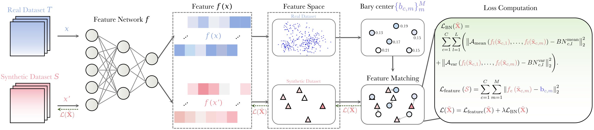

# 当数据压缩遇上几何思维：让AI用1%数据学出90%功力

深度学习的数据焦虑正在成为行业共识。训练一个 ImageNet 规模的模型，需要处理上百万张图像，耗费的算力、存储与时间成本随着数据规模线性甚至超线性增长。而数据集蒸馏（Dataset Distillation）提供了一个令人兴奋的可能：能否将海量数据的"精华"浓缩到极少量的合成样本中，让模型在这些样本上训练就能达到接近全量数据的性能？这个问题的答案，正在变得越来越肯定。

我们最近在 ICCV 2025 和 AAAI 2025 上发表的两项工作，从不同角度推进了这一领域：WMDD 从最优传输理论出发，重新审视"什么才是好的蒸馏数据"；GUARD 则从损失曲面的几何性质入手，在蒸馏过程中嵌入对抗鲁棒性。两项工作的共同点是：都在用几何的视角重新理解数据蒸馏这件事。

## 从"搬运泥土"到理解分布：WMDD 的几何直觉

想象你要用十个沙堆来代表一片沙漠的地形特征。怎样摆放这十个沙堆，才能最好地概括原本复杂的地貌？如果只是简单地取平均，你会丢失所有的起伏和细节；如果试图匹配某些统计矩，你可能会得到数学上正确但实际上毫无意义的配置。数据蒸馏面临的正是类似的挑战：用每类 10 张甚至更少的合成图像，去捕捉数万张真实图像蕴含的分布信息。

WMDD（ICCV 2025）的核心洞察来自最优传输理论。Wasserstein 距离不是简单地比较两个分布的某些统计量，而是询问：如果把一个分布想象成一堆可以流动的"质量"，将它变形为另一个分布需要付出多少"搬运成本"？这个搬运的视角天然保留了分布的几何结构——哪里有质量聚集，哪里有空隙，不同区域之间的相对位置关系，都体现在最优搬运方案中。

> 论文：Dataset Distillation via the Wasserstein Metric（ICCV 2025）  
> arXiv：https://arxiv.org/abs/2311.18531  
> 代码：https://github.com/Liu-Hy/WMDD

在具体实现上，我们把问题搬到了神经网络的特征空间。使用预训练分类器将原始图像映射到倒数第二层的特征表示后，对每个类别的特征分别计算 Wasserstein 重心。这里的"重心"不是简单的均值点，而是一组带权重的代表点——可以理解为用有限个"锚点"去近似原始特征分布的几何形态。然后，我们通过梯度优化来合成图像，让它们的特征尽可能接近这些锚点。

这种做法的优势在实验中表现得相当明显。在 ImageNet-1K 上以每类 100 张图像的预算进行蒸馏，模型训练后能达到 60.7% 的 top-1 准确率，而用全量数据训练的同架构模型是 63.1%——用不到 0.01% 的数据量，恢复了超过 96% 的性能。更令人惊喜的是跨架构泛化能力：用 ResNet-18 蒸馏的数据去训练 ResNet-101，准确率还能进一步提升到 62.57%；即使迁移到架构差异巨大的 Vision Transformer，也能获得 34.87% 的准确率（ViT-Small）。这说明蒸馏出的数据捕捉的是真实的语义结构，而不是针对某个特定模型的"捷径"。

_WMDD 的蒸馏流程：在特征空间计算 Wasserstein 重心，并通过特征匹配与按类别的 BatchNorm 统计对齐来优化合成图像_

为什么 Wasserstein 能做到这一点，而此前流行的 MMD（Maximum Mean Discrepancy）做不到？一个关键的技术原因是：为了在 ImageNet 规模上保持可计算性，许多基于 MMD 的方法实际上退化成了只匹配特征均值（相当于线性核），而均值无法唯一确定一个分布。相比之下，Wasserstein 距离在保持计算可行性的同时（在特征空间的复杂度与样本量线性相关），能够通过搬运方案隐式地考虑分布的高阶结构。我们在论文附录中从理论上分析了这一点：在合理的 Lipschitz 假设下，Wasserstein-1 距离可以直接上界真实分布与合成分布之间的泛化误差。

另一个设计细节值得一提：我们引入了 Per-Class BatchNorm（PCBN）正则化。标准的全局 BN 统计对齐在蒸馏时会让不同类别的梯度相互干扰，而 PCBN 让每个类别独立地对齐其 BN 统计量，既利用了预训练网络中的先验知识，又避免了类间的梯度冲突。消融实验显示，从交叉熵损失切换到 Wasserstein 重心匹配能带来系统性的提升，而从全局 BN 切换到 PCBN 则进一步防止了特征分布的"塌缩"，两者形成了良好的协同。

_在 ImageNet-1K 上用 10 IPC 蒸馏得到的合成图像示例，可以看到它们捕捉了类别的关键视觉特征_

从方法论的角度看，WMDD 展示了一种将经典数学理论（最优传输）与现代深度学习有效结合的范式。Wasserstein 距离在机器学习中并不陌生——它在生成对抗网络、分布鲁棒优化等领域都有应用——但将其引入数据集蒸馏，并通过重心的视角去设计具体算法，这条路径仍然充满探索空间。我们正在思考的一些延伸方向包括：能否直接在 (X, Y) 的联合空间上进行蒸馏，从而同时建模标签之间的相似性结构？能否让部分合成样本偏向决策边界附近，将全局的分布对齐与局部的判别性信号结合起来？

## 平滑的山谷更抗震：GUARD 让蒸馏数据天生鲁棒

数据蒸馏解决了"用少量数据训练"的问题，但还有一个同样重要的问题常被忽略：用蒸馏数据训练出的模型，面对对抗攻击时会怎样？

对抗鲁棒性（Adversarial Robustness）是可信机器学习的基石之一。一个微小的、人眼难以察觉的输入扰动，就可能让模型给出完全错误的预测。传统的对抗训练通过在训练时混入对抗样本来增强鲁棒性，但这种方法计算昂贵，而且我们的初步实验显示，将对抗训练直接嵌入蒸馏流程会严重损害干净数据上的准确率，鲁棒性的提升也不稳定。必须找到更本质、更高效的路径。

> 论文：Towards Adversarially Robust Dataset Distillation by Curvature Regularization（AAAI 2025）  
> arXiv：https://arxiv.org/abs/2403.10045  
> 代码：https://github.com/yumozi/GUARD

GUARD（Geometric Regularization for Adversarially Robust Dataset）的思路来自对损失曲面几何性质的理解。可以证明，模型在对抗扰动下的损失上界，主要由损失函数相对于输入的最大曲率（Hessian 矩阵的最大特征值）决定。直观地说，如果损失曲面在某个方向上弯曲得很厉害（曲率大），那么沿着这个方向稍微移动输入，损失就会剧烈变化——这正是对抗样本得以存在的原因。相反，如果能让损失曲面在输入邻域内更加"平坦"，模型自然会对小扰动不敏感。

关键的理论洞察是：如果蒸馏数据与真实数据在特征空间中分布接近（这正是好的数据蒸馏应该达到的），那么在蒸馏数据上优化曲率，能够有效地迁移到真实数据上的鲁棒性。具体来说，真实数据与蒸馏数据的对抗损失上界只相差一个与分布偏差成正比的常数项。这为我们提供了理论保证：优化蒸馏阶段的几何性质，就能影响最终模型的鲁棒性。

实现上的挑战是如何高效地降低曲率。直接计算 Hessian 的最大特征值在高维空间中是不现实的，但我们可以利用一个经验观察：对于神经网络，损失梯度的方向通常与最大曲率方向高度相关。因此，只需在梯度方向上做一个小步长的扰动，计算两点梯度的差异，就能近似地刻画该方向的曲率。我们将这个曲率正则项加入到蒸馏过程的损失函数中：每次迭代只额外增加一次前向传播和一次梯度计算，计算开销相比标准对抗训练降低了约 300 倍。

_GUARD 蒸馏的合成图像（ImageNet-1K, 1 IPC），图像呈现出语义混合的特征，反映了对核心判别信息的提取_

实验结果超出了预期。在 ImageNette 数据集的 10 IPC 设置下，相比基线方法 SRe2L，GUARD 将干净准确率从 42.42% 提升到 57.93%，同时在 AutoAttack（一种强力的组合攻击）下的鲁棒准确率从 4.99% 提升到 19.69%——鲁棒性提升了近 4 倍。在更大规模的设置（ImageNette 100 IPC）上，面对 PGD100 攻击时准确率从 31.65% 跃升至 57.50%，面对 AutoAttack 时从 17.93% 跃升至 64.84%。值得强调的是，GUARD 在提升鲁棒性的同时，干净数据上的表现也常常得到改善，而不是传统鲁棒性方法中常见的 accuracy-robustness trade-off。

更令人鼓舞的是方法的普适性。我们将 GUARD 的曲率正则化应用到不同的蒸馏范式上——包括早期的梯度匹配方法 DC、面向超大规模数据的 CDA——都观察到一致的鲁棒性与准确率的双重提升。这说明曲率正则化作为一种底层的几何约束，具有超越具体蒸馏算法的通用价值。

从更深层次理解，GUARD 之所以有效，可能是因为它在蒸馏阶段就塑造了一个"良态"的优化景观。如果教师模型的损失曲面崎岖不平，蒸馏过程很难从中稳定地提取代表性信息；而平滑的曲面意味着优化信号的一致性，合成数据更容易学到稳定的、不受高频噪声干扰的类别特征。这种稳定性既体现为对对抗扰动的鲁棒，也体现为对分布漂移的更好泛化。

我们还观察到一个有趣的现象：在极小的 IPC（如 1 或 10）下，强曲率正则同时显著提升干净准确率和鲁棒性；而当 IPC 增大到 50 或 100 时，过强的正则化反而可能抑制细粒度的判别能力。这暗示着一个更一般的原则：合成数据量越少，应该追求的模型复杂度也越低，而曲率恰好是刻画模型复杂度的几何指标。如何为不同的 IPC 自适应地调整正则强度，如何从理论上建立"样本量-模型复杂度-泛化能力"的定量关系，这些问题值得进一步探索。

## 几何视角下的数据蒸馏：一些思考

回顾这两项工作，它们在表面上解决的是不同的问题——WMDD 关注表示的精确性，GUARD 关注模型的鲁棒性——但在深层次上共享着相似的哲学：用几何的语言去理解和优化数据蒸馏。

Wasserstein 距离告诉我们，分布之间的"距离"不只是统计量的差异，而应该考虑它们在空间中的排布方式；曲率正则告诉我们，模型的行为不只取决于在训练点上的损失值，还取决于这些点周围损失曲面的形状。这种几何视角为数据蒸馏提供了比单纯的"拟合"更丰富的工具箱。

从实用角度看，两项工作都强调了效率。WMDD 通过在特征空间操作和高效的 OT 求解算法，将时间复杂度控制在与样本量线性相关的水平；GUARD 通过曲率的一阶近似，避免了显式计算 Hessian 矩阵。这些设计让方法能够真正应用到 ImageNet-1K 这样的大规模场景，而不仅仅停留在 CIFAR-10 上的概念验证。

往前看，数据蒸馏领域还有很多开放问题。例如，能否将蒸馏与生成模型更紧密结合，利用扩散模型或 GAN 的生成能力来直接合成满足几何约束的数据？能否在多模态设置（如图文配对数据）中应用类似的几何原理？当数据分布存在长尾或标签噪声时，如何调整蒸馏策略以保持鲁棒？这些问题的答案，或许同样需要我们跳出纯粹的"拟合"思维，从更本质的几何与拓扑性质去寻找。

数据蒸馏不只是压缩技术，它迫使我们重新审视"什么是有用的数据"这个根本问题。当我们能用百分之一的样本恢复百分之九十的性能，我们学到的不只是如何压缩，更是如何理解——理解数据中哪些模式是本质的，哪些是冗余的，哪些是脆弱的，哪些是稳健的。从这个意义上说，数据蒸馏是一面镜子，映照出我们对学习本身的认知深度。

而让这面镜子更清晰的路径，正是用几何的眼光去重新打量我们习以为常的学习过程。

---

**相关资源：**
- WMDD 论文：https://arxiv.org/abs/2311.18531 | 代码：https://github.com/Liu-Hy/WMDD
- GUARD 论文：https://arxiv.org/abs/2403.10045 | 代码：https://github.com/yumozi/GUARD