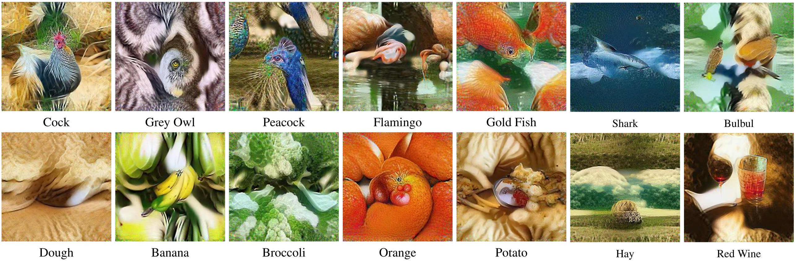

# 当数据蒸馏遇上几何与鲁棒性：两个视角下的突破

在深度学习迈向超大规模的今天，数据集蒸馏（Dataset Distillation）提供了一个令人着迷的可能：能否用极少的合成样本，浓缩出一个庞大数据集的精华？这个问题的价值不言而喻——训练成本的指数级下降、隐私保护的天然优势、以及对数据本质的更深刻理解。然而，真正让蒸馏数据"好用"的标准是什么？我们认为至少包括两个维度：一是合成数据能否忠实地捕捉原始数据的内在结构，二是基于它训练的模型能否在真实环境的各种扰动下保持稳定。围绕这两个问题，我们的 ICCV 2025 论文 WMDD 和 AAAI 2025 论文 GUARD 分别给出了答案。

## 几何的视角：WMDD 如何让合成数据"看起来对"

> 论文：Dataset Distillation via the Wasserstein Metric（ICCV 2025）｜arXiv：<https://arxiv.org/abs/2311.18531>

传统的分布匹配方法常常依赖 Maximum Mean Discrepancy（MMD）来衡量真实数据与合成数据的差异。这个选择看似自然，但 MMD 有一个微妙的局限：它对核函数的选择极为敏感，而且在实际应用中，为了计算效率，很多方法只能退化到对齐特征的均值——这相当于用线性核的 MMD。问题在于，仅仅对齐均值远远不够：两个均值相同的分布可能在形状、方差、甚至拓扑结构上天差地别。

WMDD 的核心洞察来自最优传输理论。Wasserstein 距离不仅仅是一个度量，它背后承载着"如何以最小代价把一堆沙子搬运成另一堆"的几何直觉。这种"搬运"的视角天然地保留了分布的空间结构：它关心每一份质量如何被映射，而不是简单地比较全局统计量。基于 Wasserstein 距离定义的重心（barycenter），也因此具备了一种独特的"保形"能力——它能在多个分布之间找到一个既接近所有输入、又保持各自几何特征的中心表示。

在二维玩具实验中，这种差异一目了然：当我们试图找到圆环和交叉两类分布的"中心"时，KL 散度和 MMD 给出的重心更像是两者的机械混合，而 Wasserstein 重心则通过最优传输在几何上做了自然的插值，依然能看出原始形状的影子。这正是数据蒸馏需要的——我们希望合成数据不是原始数据的"模糊平均"，而是能够体现其内在结构的精炼代表。

_图 1  在二维空间中，不同度量下的重心呈现出迥异的特性。Wasserstein 重心通过最优传输实现几何插值，更好地保留了原始分布的结构信息。_

WMDD 的实现策略兼顾了理论优雅与工程可行性。我们将合成过程置于预训练分类器的特征空间：对每个类别，先提取所有真实样本在倒数第二层的特征表示，然后在这个空间中计算 Wasserstein 重心。这个重心不是单点，而是由少量带权"锚点"组成的离散分布，每个锚点及其权重共同刻画了类内的多样性。接下来，我们通过梯度下降优化原始图像空间中的合成样本，使其在特征空间中的表示逼近这些锚点。

一个关键的技术细节是 Per-Class BatchNorm（PCBN）正则化。以往的方法倾向于在全局层面对齐 BN 统计量，但这会让不同类别的样本在优化时相互干扰——毕竟各类别的分布特性本就不同。PCBN 改为在每个类别内部独立对齐均值和方差，这样既利用了预训练模型的先验知识，又避免了类间的"拉扯"，让每个类的合成数据能更纯粹地接近其真实分布。

_图 2  WMDD 的核心流程：在特征空间计算各类的 Wasserstein 重心，然后通过特征匹配损失和 PCBN 正则共同优化原始图像，使合成数据在保持类内结构的同时贴近真实分布。_

计算效率方面，WMDD 采用了一种交替优化策略：固定锚点位置时优化权重，固定权重时优化位置。这种交替迭代在理论上收敛到局部最优，而在实践中，仅需 10 次左右的迭代就能产生高质量的重心表示。更重要的是，与 MMD 的 O(n²) 复杂度不同，我们的 Wasserstein 重心计算对原始数据量呈线性复杂度，这使得 WMDD 能够扩展到 ImageNet-1K 这样的大规模数据集。

实验结果印证了我们的理论直觉。在 ImageNette、Tiny-ImageNet 和 ImageNet-1K 上，WMDD 在几乎所有 IPC（images per class）设置下都达到了当前最佳水平。以 ImageNet-1K 的 100 IPC 为例，我们达到了 60.7% 的 top-1 准确率，已经非常接近在全量数据上训练的 ResNet-18（63.1%）。更令人惊喜的是跨架构泛化能力：用 ResNet-18 蒸馏的数据，在 ResNet-50/101 和 ViT-Tiny/Small 上都能取得稳定的性能，这说明 WMDD 捕捉的是数据的本质几何特性，而非特定架构的偏好。

_图 3  WMDD 在 ImageNet-1K 上蒸馏的合成图像（10 IPC）。尽管每类只有 10 张图像，但它们都呈现出该类别的典型视觉特征，可解释性强。_

消融实验进一步验证了设计选择的合理性。将特征匹配目标从交叉熵改为 Wasserstein 重心匹配，带来了一致的性能提升；引入 PCBN 后，类内特征分布的多样性得到了更好的保持，避免了"模式坍塌"。我们还尝试了 Sliced Wasserstein 作为加速方案，结果显示精度几乎无损，证明收益确实来自 Wasserstein 的几何本质。

从方法论的角度看，WMDD 将数据蒸馏问题重新定位为"在几何意义上寻找分布的最优表示"。这种视角不仅在技术上行之有效，也为未来的研究打开了新的空间：能否在联合空间 P(X,Y) 上直接蒸馏，从而同时学习类间关系？能否将重心表示与生成模型结合，进一步提升合成数据的多样性？这些都是值得探索的方向。

## 鲁棒性的视角：GUARD 如何让模型"站得稳"

> 论文：Towards Adversarially Robust Dataset Distillation by Curvature Regularization（AAAI 2025）｜arXiv：<https://arxiv.org/abs/2403.10045>

数据蒸馏的另一个重要挑战是鲁棒性。在真实应用中，模型常常面临各种输入扰动——无论是恶意构造的对抗样本，还是自然环境中的噪声。如果蒸馏数据只能训练出"脆弱"的模型，那么它的实用价值将大打折扣。

直觉上，最简单的做法是在蒸馏过程中引入对抗训练：用对抗样本来训练教师模型，然后基于这个"强化过"的教师来蒸馏数据。然而，我们的初步实验显示，这种做法往往事与愿违：干净样本上的准确率大幅下降，而鲁棒性的提升却不稳定。问题的根源在于，对抗训练会显著改变样本的语义，而在蒸馏数据量极其有限的情况下，这种扰动会被放大，导致合成数据偏离原始分布。

GUARD 采取了一个更本质的策略：与其在外层堆叠对抗训练的循环，不如直接优化模型的损失景观，使其在真实数据附近更加平滑。这个想法建立在一个理论观察之上：对抗损失的上界主要由损失函数关于输入的最大曲率（即 Hessian 矩阵的最大特征值）决定。换句话说，如果损失景观在某个方向上"陡峭"，那么沿这个方向的小扰动就容易造成损失的剧烈变化——这正是对抗脆弱性的根源。

理论分析表明，当蒸馏数据与真实数据在特征空间足够接近时，两者的对抗损失上界仅相差一个与分布偏差成正比的常数项。这意味着，只要我们在真实数据上平滑损失景观，这种鲁棒性就能自然地转移到蒸馏数据上。这个结论为我们的方法提供了理论保障：我们不需要在蒸馏数据上显式地进行对抗训练，只需在真实数据上降低曲率，就能获得可迁移的鲁棒性。

实现上，我们利用了一个经验观察：神经网络损失函数的梯度方向，往往与 Hessian 最大特征值对应的特征向量高度一致。基于这个观察，我们构造了一个高效的曲率正则项：在归一化梯度方向上做小步扰动，然后最小化扰动前后梯度的差异。这个正则项只需要两次前向传播和梯度计算，几乎不增加额外开销，却能有效降低损失景观的"尖锐性"。

我们将 GUARD 集成到 SRe2L 方法的"squeeze"阶段：在该阶段，原本是在真实数据上训练一个标准分类器；现在我们将训练损失替换为"标准损失 + 曲率正则"，从而得到一个损失景观更平滑的模型。随后的"recover"阶段不变，从这个平滑模型中恢复出合成数据。整个过程相比标准蒸馏仅增加了约 0.3% 的计算时间，而对抗训练则需要数倍的开销。

实验结果令人鼓舞。在 ImageNette、Tiny-ImageNet 和 ImageNet-1K 上，GUARD 在各种攻击下都显著提升了鲁棒性。以 ImageNette 10 IPC 为例，面对 AutoAttack 这种强攻击，准确率从 4.99% 跃升到 19.69%，干净准确率也从 42.42% 提升到 57.93%。这种"鲁棒性与准确性双赢"的现象，恰恰印证了我们的理论：平滑的损失景观不仅有助于抵抗对抗扰动，也让模型在蒸馏数据上学到了更稳定、更泛化的特征。

_图 4  GUARD 在 ImageNet-1K 上蒸馏的样本（1 IPC）。这些图像混合了类内多个物体的视觉元素，体现了蒸馏过程对鲁棒特征的提取。_

一个有趣的发现是，曲率正则的作用与 IPC 的大小有关。在极低的 IPC（如 1 或 10）下，曲率正则往往能同时大幅提升干净精度和鲁棒性；而当 IPC 增大时，过强的正则可能抑制模型学习细粒度的判别特征，此时需要适当降低正则强度。这似乎暗示着一个更深层的权衡：合成数据越少，模型的"可学复杂度"就应该越低，而曲率正则恰好提供了一种控制这种复杂度的手段。

GUARD 的另一个优势是普适性。作为一种损失景观正则化方法，它可以无缝集成到几乎任何基于教师模型的蒸馏方法中。我们在 DC、CDA 等不同范式上的实验都显示，加入 GUARD 后，干净精度和鲁棒性均得到提升。这种"即插即用"的特性，使得 GUARD 不仅是一个独立的方法，更是一个可以广泛应用的技术模块。

需要强调的是，GUARD 并不声称提供形式化的全局鲁棒性保证——我们的理论假设（如损失函数的局部凸性）在实践中只是近似成立。但从实用角度看，GUARD 以极小的代价，在大规模数据集和强攻击场景下都取得了可观的鲁棒性提升，这本身就说明了方法的有效性和价值。

## 两个视角的交汇

WMDD 和 GUARD 分别从几何和鲁棒性两个维度推进了数据蒸馏的前沿，但它们的底层逻辑是相通的：都试图让合成数据学到的不是表面的统计规律，而是更深层、更稳定的结构特征。WMDD 通过 Wasserstein 几何捕捉分布的形状，GUARD 通过曲率正则塑造平滑的决策边界，两者殊途同归，都在追求"少而精"的数据表示。

展望未来，这两个方向还有很多值得探索的空间。对 WMDD 而言，能否将 Wasserstein 框架扩展到更复杂的联合分布 P(X,Y)，从而同时学习特征和标签的关系？能否将重心表示与生成模型（如扩散模型）结合，进一步提升合成数据的多样性和真实感？对 GUARD 而言，能否设计自适应的曲率调节机制，根据 IPC 和任务自动调整正则强度？能否将曲率正则推广到分布外泛化和多模态学习的场景？

更宏观地看，数据蒸馏本身正在成为理解深度学习的一个重要窗口。通过极致地压缩数据，我们被迫思考：哪些信息是真正必要的？如何用最少的样本"编码"一个数据集的本质？这些问题不仅关乎工程效率，也触及了学习理论的核心。我们希望 WMDD 和 GUARD 能为这个领域贡献一些新的视角，也期待更多研究者加入到这场"少而强"的探索中来。

两篇论文的代码已在 GitHub 开源：
WMDD: https://github.com/Liu-Hy/WMDD  
GUARD: https://github.com/yumozi/GUARD

欢迎交流与合作。
