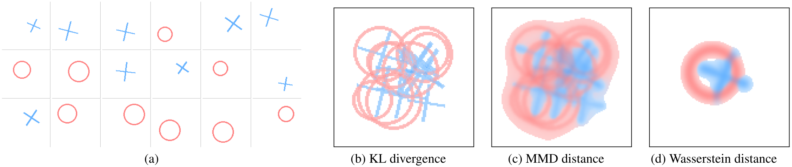

# 数据蒸馏的双重突破：从几何保真到对抗稳健

在深度学习迈向效率与可信的征程中，数据集蒸馏正展现出独特的价值：它承诺用极其精简的合成样本，替代庞大的训练集，却不牺牲模型性能。然而，这一看似简单的目标背后，隐藏着两个本质性的难题。第一个难题关乎精度：如何让寥寥数张合成图像，真正"记住"原始数据分布中那些对分类至关重要的几何结构？第二个难题关乎可靠性：在节省计算成本的前提下，能否让蒸馏数据训练出的模型天然具备抵御对抗攻击的能力？这两篇分别发表于 ICCV 2025 和 AAAI 2025 的工作，提供了各自的答案。

## 从最优传输视角重新审视分布匹配

> 论文：Dataset Distillation via the Wasserstein Metric（ICCV 2025）｜arXiv：<https://arxiv.org/abs/2311.18531>

想象一下，把数据分布比作沙堆的形状。传统的分布匹配方法，往往像是用尺子测量沙堆的高度和宽度，然后试图用这些数字重建它。但沙堆的真正形态——那些起伏、轮廓和内部的密度变化——很难被几个统计量完全刻画。WMDD 采取了截然不同的策略：它问的不是"这两堆沙有多像"，而是"把这堆沙搬成那堆沙，最省力的方式是什么"。

这一思路源于最优传输理论，一个在十八世纪由 Monge 提出、后经 Kantorovich 发展成熟的数学框架。Wasserstein 距离正是这一理论的核心度量：它将分布之间的差异量化为"搬运质量"所需的最小代价。与传统度量相比，Wasserstein 距离天然地保留了分布的几何信息——不仅关心"有多少"，更关心"在哪里"。基于 Wasserstein 距离定义的重心，也因此不是把多个分布简单叠加，而是在几何意义上寻找它们的"质心"，自然地保留了各分布的结构特征。

_图 1  分布重心的几何直觉：给定圆环与交叉两类二维分布，KL 散度与 MMD 计算的重心呈现机械的混合；Wasserstein 重心则通过最优传输的视角，在保持几何结构的前提下进行插值。色彩深浅表示概率密度，色调区分源分布类型。_

WMDD 的技术路线清晰而优雅。我们首先利用预训练分类器的倒数第二层作为特征提取器，将原始数据映射到一个语义更丰富的表示空间。在这个空间里，每个类别的样本形成一个分布，我们为其计算 Wasserstein 重心——不是单一的中心点，而是一组带权重的"锚点"，它们共同勾勒出类内分布的骨架。蒸馏过程就是优化合成图像，使其在特征空间中的投影尽可能贴近这些锚点。

这里有一个关键的技术细节：传统的全局 BatchNorm 对齐会把所有类别的样本混在一起计算统计量，这容易产生类间干扰，模糊各类的特定特征。我们提出的 Per-Class BatchNorm（PCBN）将统计量的计算和对齐限制在类内，让每个类别独立地匹配其 BN 层的均值和方差。这一简单的改动，让合成数据既能利用预训练模型的先验知识，又不失去对类内多样性的刻画。

_图 2  WMDD 的核心流程：通过特征提取、重心计算、特征匹配与类内 BN 对齐四个步骤，将高维图像数据蒸馏为紧凑的合成集。重心的位置和权重通过高效的最优传输算法求解，确保方法可扩展至大规模数据。_

为什么 Wasserstein 在这里比传统的 MMD 更有效？一个重要原因是，完整的核化 MMD 需要对所有样本对计算核函数，其复杂度随数据量平方增长，在 ImageNet 规模上几乎不可行。实践中，许多基于 MMD 的方法退而求其次，只对齐特征的一阶矩（均值），这相当于使用线性核。但线性核无法唯一确定分布，高阶的几何信息全部丢失。相比之下，Wasserstein 距离在理论上有清晰的保证：在合理的 Lipschitz 假设下，分布间的 Wasserstein 距离直接上界了模型在两个分布上的期望风险差异。同时，借助现代最优传输算法，我们可以高效地在特征空间求解重心，复杂度只随数据量线性增长。

实验结果令人鼓舞。在 ImageNette、Tiny-ImageNet 和 ImageNet-1K 上，WMDD 在 1、10、50、100 IPC 的多个设置下都达到了当前最佳或极具竞争力的性能。以 100 IPC 为例，在三个数据集上的准确率分别为 87.1%、61.0% 和 60.7%，已经非常接近在全量数据上训练的 ResNet-18（89.9%、63.5%、63.1%）。更令人惊喜的是，用 WMDD 蒸馏的数据展现出优异的跨架构泛化能力：用 ResNet-18 蒸馏、用 ResNet-50/101 评估，性能仍能随模型容量提升；迁移到 Vision Transformer 上，也有明显的正向效果。这表明，WMDD 捕捉的是数据分布的本质特征，而非针对特定网络的"捷径"。

_图 3  WMDD 生成的合成图像（ImageNet-1K，10 IPC）。每张图像都呈现出相应类别的典型视觉特征，具有一定的可解释性。_

消融实验进一步验证了设计的合理性。将特征匹配目标从交叉熵改为 Wasserstein 重心回归，在所有数据集上都带来了稳定的性能提升。引入 PCBN 后，合成图像在特征空间的分布更加多样，避免了"模式坍缩"。我们还测试了 Sliced Wasserstein 作为加速手段，结果显示性能几乎无损，证明了方法收益的来源确实是 Wasserstein 几何本身，而非超参数的精细调优。

WMDD 将数据蒸馏带回到分布几何的根本问题：用最小代价去逼近真实分布的"形状"。这种思路不仅在当前的实验中展现出优势，也为未来的扩展留下了空间。例如，能否在输入与标签的联合空间 P(X, Y) 上直接进行蒸馏，从而同时建模类别间的相似性结构？又或者，能否将重心的全局对齐与决策边界附近的支撑点相结合，让蒸馏数据既有代表性又有判别性？这些问题值得进一步探索。

## 从损失曲率到鲁棒蒸馏的理论桥梁

> 论文：Towards Adversarially Robust Dataset Distillation by Curvature Regularization（AAAI 2025）｜arXiv：<https://arxiv.org/abs/2403.10045>

如果说 WMDD 解决的是"蒸馏数据是否准确"的问题，那么 GUARD 要回答的则是"蒸馏数据是否可靠"。具体而言，在蒸馏数据上训练的模型，能否在面对精心设计的对抗样本时依然保持稳健？这一问题在可信机器学习的语境下尤为重要，因为数据蒸馏本身就常被用于保护数据隐私或降低训练成本，而鲁棒性恰恰是可信系统的另一支柱。

直觉上，最直接的方法是在蒸馏过程中引入对抗训练：用对抗样本训练教师模型，再用这个鲁棒的教师去蒸馏数据。然而实验表明，这种做法往往适得其反——不仅干净精度大幅下降，鲁棒性的提升也不稳定。问题的根源在于，对抗训练会显著改变损失景观，甚至可能扭曲图像的语义信息，而蒸馏数据量本身就极少，分布与原始数据差异较大，这种扭曲会被进一步放大。

GUARD 选择了一条更为根本的路线：不依赖对抗样本，而是直接从损失函数的几何性质入手。理论分析表明，模型在对抗扰动下的损失可以通过 Taylor 展开近似，其上界由三项决定：原始损失、梯度的范数以及 Hessian 矩阵的最大特征值（即最大曲率）。在合理的假设下，真实数据与蒸馏数据上的对抗损失上界只相差一个与分布偏差成正比的常数。这意味着，只要蒸馏数据在特征空间足够接近真实数据，降低真实数据上的最大曲率，就能有效提升蒸馏数据训练出的模型的鲁棒性。

具体实现时，直接计算 Hessian 的最大特征值代价高昂。GUARD 利用了一个经验观察：在神经网络的输入空间中，梯度方向与最大曲率对应的特征向量方向高度一致。因此，我们用归一化的梯度方向作为曲率的近似方向，在该方向上施加小步长扰动，最小化扰动前后梯度的差异。这一正则项只需额外一次前向传播和梯度计算，比对抗训练的内层优化高效得多。我们将其嵌入到 SRe2L 方法的"squeeze"阶段，替换标准的训练损失为"原损失 + 曲率正则"。

在三个高分辨率数据集和多种攻击设置下，GUARD 都展现出显著的鲁棒性提升。以 ImageNette 10 IPC 为例，相比 SRe2L，干净准确率从 42.42% 跃升至 57.93%，AutoAttack 鲁棒性从 4.99% 提升到 19.69%。在 Tiny-ImageNet 50 IPC 上，PGD100 攻击下的准确率从 0.27% 提升到 15.63%，AutoAttack 从 0.16% 提升到 13.84%。更有趣的是，GUARD 在提升鲁棒性的同时，常常也提升了干净精度——这一现象可以理解为，平滑的损失景观不仅抵御了对抗扰动，也增强了模型的泛化能力。

_图 4  GUARD 生成的合成图像（ImageNet-1K，1 IPC）。图像融合了类内的多种视觉元素，反映了蒸馏过程对核心语义的提炼。_

背后的直觉其实并不晦涩。如果教师模型的损失景观在数据点附近崎岖不平、曲率很大，那么沿着不同方向的梯度会剧烈变化，蒸馏过程很难从这种不稳定的梯度场中提取出稳定的、具有代表性的合成样本。相反，当损失景观被正则化得更加平滑，局部接近线性，合成数据就能更好地"捕捉"到真实数据的核心特征，而不受高频噪声或对抗扰动的干扰。

值得一提的是，GUARD 的有效性并不局限于某一种蒸馏方法。我们将其应用于 DC、CDA 等不同范式的蒸馏算法，都观察到了干净精度与鲁棒性的双重提升。这种普适性源于 GUARD 的设计理念：它不是一个独立的蒸馏算法，而是一个可插拔的正则化模块，适用于任何使用真实数据训练教师模型的蒸馏流程。

实验中还发现了一个有趣的现象：在 IPC 较小（如 1 或 10）时，曲率正则能同时显著提升干净精度和鲁棒性；而当 IPC 较大时，过强的正则可能抑制模型对细粒度特征的学习，此时适当减弱正则强度效果更好。这似乎暗示了一个原则：蒸馏数据越少，模型复杂度应当越受约束，否则容易过拟合到蒸馏集的特殊性而失去泛化能力。如何从理论上精确刻画这一权衡，是一个值得深入的问题。

需要强调的是，GUARD 并不声称提供形式化的全局鲁棒性保证。理论分析中的假设——如损失函数的局部凸性、特征映射的 Lipschitz 连续性——在实践中只是近似成立。但正是这种理论与实践的巧妙结合，让 GUARD 以极低的计算代价，在大规模数据和强攻击场景下都表现出色。

两篇论文的代码已经开源：  
WMDD <https://github.com/Liu-Hy/WMDD>  
GUARD <https://github.com/yumozi/GUARD>

## 汇聚：效率、精度与可信的三位一体

这两项工作从不同的角度推进了数据集蒸馏的边界。WMDD 用最优传输的语言重新定义了分布匹配，让蒸馏数据在几何上更忠实于原始分布；GUARD 从损失景观的曲率出发，以最小的开销为蒸馏数据注入了鲁棒性。它们的共同点在于，都没有止步于简单地"提高指标"，而是试图理解蒸馏过程的内在机制，并从原理层面给出改进方案。

展望未来，数据集蒸馏仍有许多值得探索的方向。能否在输入与标签的联合分布上进行蒸馏，从而更好地建模类别间的关系？能否将生成模型的表达能力与重心表达的几何直觉相结合，进一步提升蒸馏数据的多样性？曲率正则能否根据 IPC、数据集特性和任务需求自适应调整，以达到精度与鲁棒性的最优平衡？这些问题的答案，或许将推动数据蒸馏从"能用"走向"好用"，成为连接效率与可信的关键一环。

在大模型训练成本日益高企、数据隐私保护愈发重要的今天，"小而精"的数据集不再是奢望，而是必需。我们期待数据集蒸馏技术能在这一转变中扮演更核心的角色，为可持续、可信的 AI 发展提供一条切实可行的路径。
