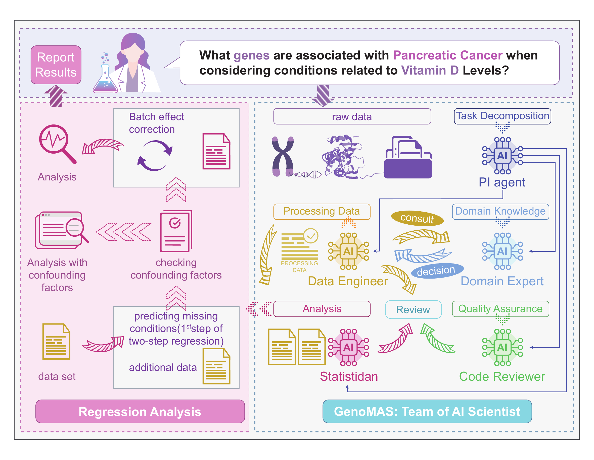

# GenoMAS：当智能体学会写代码做科研

- 论文标题：GenoMAS: A Multi-Agent Framework for Scientific Discovery via Code-Driven Gene Expression Analysis
- arXiv 链接：https://arxiv.org/abs/2507.21035

## 引子：自动化科研的信任危机

过去两年，大模型在代码生成上的进步令人瞩目。从帮我们补全函数，到生成完整的数据分析脚本，AI辅助编程已经深入到日常科研工作的各个环节。但有一个更激进的问题始终悬而未决：能否让智能体完全自主地完成一项科学分析任务，从读取原始数据到输出可靠的科学结论，中间不需要人工干预？

这个问题之所以难回答，并非因为技术上做不到端到端执行，而是因为"可靠"二字太过沉重。在科研领域，一个看似微小的方法选择失误——比如忘记校正批次效应，或者错误理解临床表型的定义——都可能让整个分析在科学上失效。更棘手的是，这类错误往往隐蔽而深远，代码能顺利跑通，数字看起来也合理，但结论可能完全站不住脚。

我们的工作就是在这个背景下展开的。我们选择了基因表达分析这个具体而充满挑战的场景，试图回答：如何构建一个既能自主运行，又足够可信的智能体系统。

*图1：GenoMAS 通过六个专业化智能体的协作，完成从原始数据到显著基因识别的端到端分析*

## 为什么基因表达分析是个好的试金石

基因表达分析在生物医学研究中扮演核心角色。它试图回答这样的问题：哪些基因的表达水平与特定的疾病或生理特征显著相关？这类关联对于理解疾病机制、预测药物反应、制定个性化医疗方案都至关重要。看似简单的问题，实际执行起来却困难重重。

困难首先来自数据本身的复杂性。转录组数据通常包含两万多个基因在数百个样本上的表达值，维度远高于样本数，统计推断本就不易。数据还来自不同的测量平台——微阵列和RNA测序有着截然不同的数据格式和预处理流程。基因命名系统在不断演化，同一个基因可能有多个别名或过时的标识符，需要仔细比对和归一化。临床信息则更加凌乱，往往以半结构化甚至自由文本的形式存在，从中准确抽取年龄、性别、疾病状态等关键变量需要相当的领域知识和判断力。

更深层的困难在于混淆因子的控制。批次效应、人群分层、隐藏的协变量，都可能引入虚假关联。如果分析流程没有正确处理这些干扰，识别出的"显著基因"很可能只是技术噪音的产物，而非真正的生物学信号。这要求分析者不仅要懂统计，还要理解生物学背景，能在关键节点做出正确的方法学选择。

正因为这些挑战的存在，基因表达分析成为检验智能体自动化能力的理想场景。它不是那种"能跑就行"的任务，而是对精确性和科学严谨性有着刚性要求的真实科研工作。如果智能体能在这里站稳脚跟，那它离真正的科研自动化就更近了一步。

## 思考可信自动化：在控制与灵活之间找平衡

在着手设计系统之前，我们花了很长时间思考一个根本问题：什么样的自动化才是可信的？

一种思路是彻底的自主。给最强的大模型一个任务描述，让它自己规划、自己执行、自己纠错，最后把结果交给用户。这种方案听起来很美好，也是当下很多智能体产品努力的方向。但我们认为，对于严肃的科研任务来说，这种"黑箱式"的自主还远远不够可信。原因很简单：科研方法本身就没有唯一的标准答案。不同的实验室、不同的学派，在具体的操作细节上会有不同的偏好和惯例。这些差异在重要任务中会体现在每一个环节，而且往往没有妥协的余地。如果用户无法掌控系统遵循什么样的方法学路线，就很难真正信任产出的结果。

另一种思路是严格的流程控制。预先定义好每一步该做什么，把分析流程固化为一个确定的有向无环图，智能体只需要按图索骥执行即可。这种方案能保证可复现性，但问题在于过于僵化。真实世界的数据总是充满意外：某个数据集可能缺失关键字段，某个步骤可能因为数据格式的细微差异而失败。如果系统不具备灵活应变的能力，就会在边界情形下频繁失效，最终还是需要人工介入修补。

我们的答案是把两者结合起来：用可编辑的指南（guidelines）来明确"做什么"，用自主的智能体来灵活地"怎么做"。指南是用户可以审阅和信任的文本，它清楚地表达了分析的主要步骤、依赖关系和方法学立场。智能体则在这个框架内自主工作，当遇到意外情况时能探索解决方案，当发现早期决策有问题时能回退修正，当需要领域知识时能主动咨询。这种设计让系统既有主心骨，又不会在遇到挫折时束手无策。

*图2：单个编程智能体如何基于指南进行上下文感知的规划，并通过代码记忆和多轮审阅机制保证质量*

## 系统设计：一个会写代码的科研团队

GenoMAS 的核心是把智能体当作会编程的科研工作者，而不仅仅是调用工具的调度器。系统由六个角色组成，每个角色都有明确的职责和专长。

PI 智能体负责全局协调。它根据任务需求和数据依赖关系，动态分配工作给下游的执行者。它的工作相对轻量：识别哪些数据集需要预处理，在预处理完成后触发统计分析，全程监控任务进度和资源消耗。正因为编程智能体有足够的自主性，PI 才能以较少的通信实现高效的编排。

两个数据工程师智能体是系统的主力。GEO 智能体专注于处理来自基因表达数据库（Gene Expression Omnibus）的数据，TCGA 智能体则负责癌症基因组图谱（The Cancer Genome Atlas）的数据。它们各自掌握平台特定的数据格式、常见的陷阱和预处理技巧。这种分工不是简单的任务切分，而是让每个角色能在自己的专业领域内积累经验、构建代码记忆，从而在遇到相似问题时快速复用已验证的方案。

统计学家智能体承担分析阶段的核心工作。它根据数据特征选择合适的回归模型，控制混淆因子，识别显著基因。这里的关键不在于选什么模型——Lasso 回归及其变体在高维稀疏场景下已经相当成熟——而在于能否正确地处理批次效应、协变量调整等容易被忽略但直接决定结果有效性的步骤。

代码审阅者和领域专家智能体构成质量控制的双重保障。代码审阅者的职责是检查生成的代码能否执行、是否遵循了任务指南，必要时给出明确的修改建议。为了保证独立性，审阅者在评审时只看到当前的代码尝试和总体任务历史，而不知道之前轮次的审阅意见，这避免了连续偏差的累积。领域专家则在涉及生物学判断的节点介入，比如如何从复杂的临床描述中抽取标准化的表型变量，如何处理基因标识符的歧义。它直接以可执行代码的形式给出决策，让领域知识能够无缝融入流程。

特别值得一提的是，我们采用了异构模型的团队配置。编程主力由 Claude Sonnet 4 驱动，它在代码生成和智能体任务上表现出色。规划逻辑和代码审阅由 OpenAI o3 承担，因为它的推理能力更强，能更好地发现隐藏的 bug 并给出有针对性的修复建议。领域专家则使用 Gemini 2.5 Pro，这个模型在生物学知识的准确性和广度上有明显优势。这种认知多样性的组织方式，类似于真实世界里跨学科团队的协作，不同背景的人各展所长，反而比单一超强个体更稳健。

## 引导式规划：让智能体会"看情况办事"

GenoMAS 的编程智能体并不是机械地按流程图执行任务，而是在每一步都能根据上下文做出决策。这种能力来自我们设计的引导式规划机制。

任务指南被组织为一个有向无环图，图中的每个节点是一个"动作单元"（Action Unit）——一个语义自洽、可以原子化执行的操作。比如 GEO 智能体的指南包含加载数据、抽取临床特征、基因注释、表达值归一化等动作单元。每个单元都有清晰的前置条件、执行内容和预期输出，就像实验手册里的一段操作步骤。

智能体在执行过程中，会持续分析当前的任务历史和数据状态，然后选择下一个动作：是顺着主路径前进，还是回退到之前的某个节点尝试替代方案，还是跳过某个可选步骤，还是认为任务已经完成可以终止。这些选择不是随意的，而是基于对已有信息的推理。比如，如果发现某个临床字段在元数据中完全缺失，智能体可以选择跳过相关的抽取步骤；如果发现早期选择的归一化方法在后续检查中暴露出问题，智能体可以回退到归一化节点，换一个方法重新来过。

这种回退机制尤其重要。基因表达分析是个高度耦合的流程，早期的一个小失误会在后续步骤中被放大。传统的顺序执行一旦走入死胡同，就只能从头再来或者人工介入。GenoMAS 的智能体能主动识别这种情况，将代码状态和任务上下文一起回滚到合适的分叉点，从另一条路径继续推进。这让系统在复杂的边界情形下也能保持逻辑连贯。

代码生成本身也经过精心设计的多轮迭代。每个动作单元的代码完成后，会发送给审阅者或领域专家进行评估。评估者给出通过或拒绝的决策，如果拒绝则附带详细的修改建议。编程智能体收到反馈后，结合历史尝试和诊断信息进行修订，再次提交审阅，直到通过或达到重试上限。这个过程中，审阅者每次只看当前尝试，保持评估的独立性；编程智能体则能看到所有历史，从而综合各轮反馈持续改进。

为了提升效率，系统维护了一个代码记忆库。每当一个动作单元的代码通过审阅，它就会被索引存储。下次遇到同类型的动作单元时，智能体可以直接复用已验证的代码片段，节省生成和调试的时间。这个记忆库不是静态的，智能体可以根据新任务的需要更新或替换其中的条目，让系统随着经验的积累变得越来越高效。

## 实验结果：在真实复杂度面前的表现

评估的基准是 GenoTEX，一个专门为基因表达分析自动化设计的数据集。它包含 913 个真实的转录组数据集，覆盖 132 个人类表型，共计 1,384 个基因-表型关联问题。这些表型既有癌症、糖尿病这样的重大疾病，也有身高、骨密度这样的生理特征，还包括若干有代表性的罕见病。基准的评估是端到端的：从数据集选择，到预处理（包括表达矩阵和临床特征的提取），再到统计分析识别显著基因，每个阶段都有对应的指标和专家标注的参考答案。

GenoMAS 在预处理阶段取得了 89.13% 的综合相似度相关系数（CSC），在显著基因识别上取得了 60.48% 的 F1 分数，相比此前最好的方法分别提升了 10.61 和 16.85 个百分点。端到端执行成功率达到 98.78%，同时 API 成本下降约 44.7%。这些数字的背后是系统在真实数据的异质性和边界条件中反复锤炼出的稳健性。

*图3：GenoMAS 在 GenoTEX 基准上的性能对比*

进一步的对比实验揭示了异构模型配置的价值。如果让所有智能体都使用同一个大模型作为后端，性能会明显下降。单用 Claude Sonnet 4 的配置在 F1 上只有 52.98%，比 GenoMAS 低了 7.5 个百分点，成本反而高出近一半。这说明认知多样性不是锦上添花，而是在复杂任务上取得优势的关键因素。

我们也测试了几个通用智能体框架，包括在生物医学领域整合了大量工具的 Biomni。尽管 Biomni 在设计上已经针对生物医学任务做了专门优化，它在这个基准上的 F1 只有 14.82%，远低于 GenoMAS。这不是因为模型不够强，而是因为任务的本质需求不同。通用智能体强调开放域的完全自主，但基因表达分析更需要的是"遵循可复核指南的受控执行"和对边界情形的稳健处理。没有精确的流程控制机制，单靠自主性很难在这类任务上取得可靠的结果。

## 拆开看：瓶颈在哪里

把流程拆解开来分析，可以更清楚地看到困难集中在哪里。

数据集筛选和选择阶段相对容易，智能体在这里的准确率都还不错。但早期的失误会产生放大效应：一旦起步选错了数据集，后续每一步都要为此付出代价，最终结果往往无可挽回。

预处理阶段呈现出明显的分化。在处理表达矩阵时，GenoMAS 能稳定达到 91.15% 的 CSC，表明系统在应对基因数据的技术复杂性上已经相当成熟。但在临床特征抽取上，CSC 只有 32.61%，成为整个流程的主要瓶颈。这个差距反映了临床数据的本质困难：它们以半结构化文本、不一致的命名、多样的来源形式存在，从中准确抽取标准化变量，需要的不仅是数据处理技巧，更是对生物医学语义的深刻理解。

为了隔离统计分析环节的能力，我们做了一个对照实验：直接使用专家预处理好的数据作为输入，让智能体只负责建模和基因识别。在这个干净的场景下，GenoMAS 的 F1 可以达到约 95%，接近人类专家的水平。但如果去掉批次效应校正，性能会显著下降。这说明，统计建模本身对于现代智能体来说并不是难题，真正的挑战在于能否在复杂的流程中系统性地控制混淆，尤其是那些容易被忽略但对结果至关重要的步骤。

消融实验进一步证实了架构中每个组件的必要性。去掉上下文感知的引导式规划，性能下降明显，系统在边界情形下更容易陷入死循环或做出低效决策。去掉领域专家，临床特征抽取和基因符号映射的准确率都受影响。限制审阅轮数为一轮，看似节省了时间，但识别能力的下降最终得不偿失。完全去掉审阅机制，性能直接腰斩，成功率也大幅下降。这些结果共同表明，"可复核指南 + 自主执行 + 严格审阅"的组合不是过度设计，而是应对真实复杂度的刚需。

我们还设置了一个零样本基线：让 OpenAI o3 在不读取数据的情况下，纯靠参数化知识去预测哪些基因与表型相关。结果 AUROC 只有 0.56，基本等同于随机猜测。这强调了结构化数据处理和领域推理的不可替代性——智能体必须真正地读数据、处理数据、在数据中寻找模式，而不是仅凭记忆推测答案。

## 智能体怎样协作：从通信模式看系统行为

在一个包含 20 个问题的代表性会话中，我们记录了智能体之间的所有消息交互。数据工程师（GEO 和 TCGA 合并计算）主导了 56.9% 的通信量，这符合预处理作为最繁重环节的预期。统计学家占 11.6%，在分析阶段承担关键角色。PI 的消息量只有 2.3%，却有效地编排了整个流程，这说明系统的自主程度很高，97.7% 的交互都是智能体之间自我协调的结果。

*图4：智能体通信网络与消息类型分布揭示了系统的协作模式*

消息类型的分布也很有启发性。规划请求和响应占比最高（各 634 条），这验证了引导式规划在每个任务节点的核心作用。代码校验请求排第二（351 条），但需要修订的错误消息很少（只有 36 条），说明多轮审阅机制和引导式规划已经在前端有效地防止了错误的发生。这与 98.78% 的端到端成功率是相互印证的。

这种通信结构本质上是在"集中执行 + 分布式专长"之间找平衡。有一个清晰的主轴保证流程不散，但在边界情形和专业判断上保留足够的适配空间。这也解释了为什么异构模型配置能带来额外收益：让擅长编码的模型专注写代码，让推理能力强的模型负责规划和审阅,让知识面广的模型提供领域判断，各司其职的团队协作往往比单打独斗的超强个体更可靠。

代码记忆机制的效率也值得关注。在处理前 50 个数据集的过程中，记忆复用率快速爬升，最终稳定在约 65%。累计节省的时间接近一小时，平均每次复用节省 20 秒左右。这个机制之所以有效，是因为基因表达分析中确实存在大量可复用的模式——加载 GEO 文件、映射基因符号、归一化表达值——这些操作在不同数据集上的逻辑是相似的。捕获并重用这些模式，让系统能把有限的计算资源集中在真正需要创造性解决的问题上。

## 收尾：可信自动化还有多远

回到开头的问题：能否让智能体完全自主地完成科研分析，同时让结果足够可信？

GenoMAS 给出的答案是谨慎乐观的。在基因表达分析这个场景里，通过"用户信任的指南 + 自主的编程智能体 + 多层次的质量控制"，系统确实能在大多数情况下产出科学上有效的结果。但这不意味着问题已经解决。临床特征抽取的瓶颈还很明显，极端数据情形的处理还不够稳健，对指南的遵循程度还需要更强的可验证机制。更根本的是，大模型的概率本质决定了我们无法做到 100% 的遵守，只能在现有基础上通过架构设计和系统编排尽可能地逼近。

但这项工作或许提供了一条务实的路径。与其期待一个无所不能的超强模型横空出世，不如先把"如何做事"讲清楚，再让系统在这个框架内自主工作、允许犯错、学会修正。把可控性和适应性压在同一个架构里，让用户能信任流程的主干，也让智能体有空间应对意外。在真实数据的锤炼中反复打磨，最终用数据说话。

我们正在把这套思路推广到更复杂的多组学场景，结合更强的规划算法和更细粒度的因果推断，希望能把"可信自动化"从流程合规推进到知识层面的可靠。路还很长，但方向也许是对的。

*论文链接：https://arxiv.org/abs/2507.21035*  
*代码开源：https://github.com/Liu-Hy/GenoMAS*