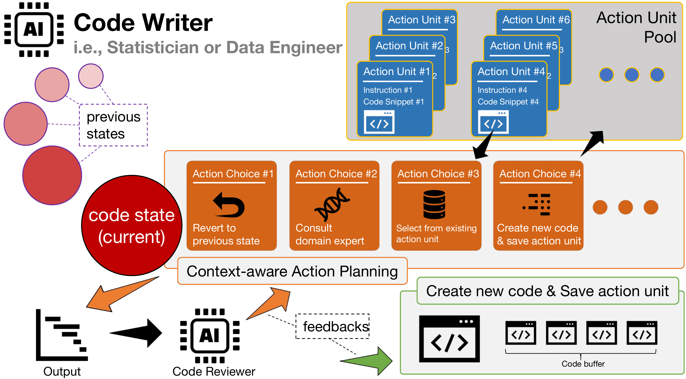

# 当AI智能体遇上基因分析：一支"会写代码"的虚拟科研团队

- 论文标题：GenoMAS: A Multi-Agent Framework for Scientific Discovery via Code-Driven Gene Expression Analysis
- arXiv 链接：https://arxiv.org/abs/2507.21035

## 从代码生成到科学自动化

今天的大语言模型已经能够理解自然语言、回答问题、生成文本，甚至编写代码。但如果要让它们真正参与科学研究，完成从原始数据到科学发现的完整链条，会发生什么？这个问题听起来充满诱惑，却也暗藏陷阱。一方面，现代科学研究的核心工作流程早已数字化，从基因组学到药物研发，从气候模拟到材料发现，几乎所有领域都依赖复杂的计算分析流程。这些流程由代码驱动，需要处理异构数据、应用统计模型、控制混淆变量，每一步都对精确性有严格要求。另一方面，尽管智能体技术发展迅猛，但大多数系统仍然停留在调用工具、检索文档或规划抽象任务的层面，距离真正能够独立完成科学计算任务还有相当距离。

我们最近完成的这项工作，选择了基因表达分析作为切入点，试图探索一条通往科学自动化的实际路径。基因表达数据分析是计算生物学的核心任务，它试图从转录组数据中识别与特定表型显著相关的基因，同时严格控制年龄、性别、批次效应等混淆因素的干扰。这个任务之所以困难，不仅因为数据的高维稀疏性和技术平台的异构性，更在于它需要在每个关键节点做出正确的领域决策。微阵列数据需要探针映射，RNA测序数据需要比对与定量，基因命名在不同数据库版本间持续演化，临床元数据藏在半结构化的文本里，批次效应和群体分层如果处理不当会导致虚假关联。这些挑战共同构成了一个严峻的测试场景：智能体能否在真实的科学约束下，生成、调试并验证可执行代码，最终产出科学上有效的分析结果？

本文将展开三个部分的讨论：为什么现有方法难以胜任这个任务，我们的系统如何设计，以及实验中观察到的核心现象与性能表现。

- 图1：GenoMAS 的多智能体协作架构。六个专业化角色通过类型化消息协议协同工作，形成端到端的分析流水线。

## 科学自动化的两难困境

在着手设计系统之前，我们首先系统测试了当前最先进的自主智能体方法，包括开源系统和商业产品。结果令人警醒：即使是集成了150种生物医学工具、105个软件包和59个数据库的Biomni系统，在我们的评估中也只能达到14.82%的F1分数，远低于人类专家的71.63%。其他通用智能体的失败率更高，甚至无法完成端到端的分析流程。我们在论文附录中详细记录了这些失败案例，它们暴露出两个根本性问题：一是智能体无法充分理解和遵循领域特定的分析规范，在流程早期犯下的错误会在后续步骤中层层放大；二是缺乏上下文感知的规划机制，无法在工作流层面识别偏离和恢复错误。

另一个极端是传统的工作流系统。它们通过预定义的有向无环图来编排分析步骤，能够确保流程的可控性，但僵化的结构使其在遇到边界情况时束手无策。基因表达数据的现实复杂度远超理想化场景：某些队列的临床信息缺失，某些平台的探针注释过时，某些样本的批次效应异常，这些问题需要分析者根据具体情况灵活应对。固定的工作流无法自适应地调整执行路径，而完全自主的智能体又容易偏离科学规范。这种"可控性"与"自适应性"之间的张力，正是科学自动化面临的核心困境。

这个困境背后，其实反映了更深层的问题。大语言模型作为统计模型，其能力高度依赖训练数据的分布。对于互联网上高频出现的任务，比如解数学题、编写常见算法，模型往往表现出色。但基因表达分析这类专业化任务，其完整的分析范例在公开数据中极为稀缺。我们在项目初期曾试图组织研究生课程来构建基准数据集，但生物信息学教授明确表示这个任务对学生而言"过于专业化"。即便是网上的示例代码也难以搜集，仅有的几个有用案例还都是基于R语言的。这种数据稀缺性使得模型面临严重的分布外泛化挑战。此外，大语言模型将所有信息以字符串形式输入注意力机制处理，这种方式难以应对需要从数百兆文件中选择性提取和整合关键信息的任务。一位熟练的生信专家往往只需在关键节点查看几十行数据，就能做出正确判断，而模型却容易在超长上下文中迷失重点。

## 系统设计：让"可信"成为核心原则

基于上述思考，我们的设计理念变得清晰：不追求单个模型的全能，而是将"如何做事"的知识显式化为可编辑的指南，再赋予执行者足够的自主性。具体而言，GenoMAS将用户认可的分析规范编码为有向无环图结构的指南文档，并将其中的关键操作切分为语义自洽、可原子执行的行动单元（Action Unit）。每个行动单元就像实验室里的一条标准操作步骤，既可以独立审核，也可以在必要时回滚或替换。编程智能体不会被迫沿着固定路径前进，而是在每一步根据上下文做出选择：是继续前进、修订代码、跳过某些步骤，还是回退到更早的分叉点尝试替代方案。

这种机制的核心在于平衡"可信"与"灵活"。什么是可信的科学自动化？我们认为，即使大模型变得极为强大和智慧，也不意味着它就"可信"。科学研究并没有一致认同的标准答案，不同学派有不同立场，不同实验室对方法细节有不同理解。在执行重要任务时，这些差异会体现在操作的各个方面，而越是关键的任务，越需要明确立场。如果向智能体丢一句简单指令，让它按照自己的理解全自动完成科研工作，然后直接端出结果，对严肃的研究者来说恐怕难以接受。因此，可信的科学自动化首先要让用户选择自己信任的指南，在充分知情与认同的前提下对结果负责。而智能体这一侧，则需要确保按照指南工作，同时对执行中的各种问题自主探索解决方案，避免像人为编排的工作流那样僵化。

在架构层面，GenoMAS组织了六个专业化智能体，分为三类角色。首席研究员（PI）负责统筹调度，动态分配任务并管理依赖关系。两位数据工程师分别负责GEO和TCGA数据的预处理，各自掌握对应平台的数据格式和常见陷阱。统计学家负责回归建模与显著基因识别，同时控制批次效应和协变量。代码审阅者验证生成代码的可执行性和对指南的遵循，给出明确的否决或修改建议。领域专家在涉及生物学语义的节点提供判断，比如临床特征抽取和基因符号映射。角色之间通过带类型的消息协议沟通，所有请求与响应都有据可查。

值得注意的是，我们采用了"异构模型"的团队配置。编程主力由Claude Sonnet 4驱动，它在代码生成上表现优异。规划与审阅由OpenAI o3承担，它的推理能力更强。领域专家由Gemini 2.5 Pro支撑，它在GPQA和HLE等科学知识基准上名列前茅。这种认知多样性的组织方式，在复杂任务上往往更稳健，也更接近真实的跨学科协作。实验结果证实，相比所有智能体使用同一个模型的同构配置，异构配置在F1分数上额外提升7.5%，API成本降低48.9%。

在代码生成层面，我们坚持"编写—审阅—修订"的闭环。审阅者在隔离上下文的前提下检查代码，不看之前的审阅反馈，从而避免级联偏见。编程智能体据此整合历史诊断信息完成修订，直到通过或达到上限。对于需要生物学判断的步骤，领域专家接收聚焦的上下文（如元数据摘要和中间结果），返回可执行的代码形式指导。这个过程也是迭代的，失败会路由回同一专家继续调试，直到收敛。

为了让系统"跑得稳"，我们在工程上补足了基本盘：并行执行与断点续跑、结果缓存与资源监控、超时保护与失败回收。通过"代码记忆"机制，系统把已通过审阅的代码片段按行动单元类型索引与重用，在保持稳健的同时逐步积累经验。为了保证可复现性，我们将基因同义词库和基因-表型关联资源本地化并版本化管理。这些设计共同确保了GenoMAS在处理真实世界基因组数据时的可靠性与可扩展性。

- 图2：单个编程智能体的规划、代码记忆与自我纠错流程示意。智能体在每一步都根据上下文选择行动单元，可以前进、回退、跳过或咨询专家。

## 实验验证：在GenoTEX基准上的系统检验

我们在GenoTEX基准数据集上评估了GenoMAS。这个基准包含913个真实数据集、132个表型、共1384个基因-表型关联问题，从数据筛选、预处理到统计分析全流程评估。表型涵盖从常见重大疾病到罕见疾病，以及身高和骨密度等身体特征，具备明确的生物学与临床相关性。评估指标包括结构与数值的一致性（属性交并系数AJ、样本交并系数SJ和复合相似相关CSC）、统计分析的AUROC和F1分数，以及端到端成功率、时间与成本。

结果显示，GenoMAS在数据预处理上达到89.13%的CSC，在显著基因识别上达到60.48%的F1，较之前最优方法分别提升10.61%和16.85%。端到端执行成功率达到98.78%，API成本降低约44.7%。这些数字的意义不仅在于"更高一些"，而在于证明了将"可复核指南 + 自主执行 + 严格审阅"组织在一起，确实能在真实复杂度面前站稳脚跟。

进一步的对照实验揭示了性能瓶颈的位置。数据集筛选本身并不困难，但一旦起步偏离，后续每一步都会为此付出代价，这种"早期误差放大效应"在流水线中极为明显。预处理阶段呈现分化：在表达矩阵处理上，系统能够稳定达到91.15%的CSC；而在临床特征抽取上，CSC仅为32.61%，这反映了半结构化文本、命名异构与来源不一致带来的挑战。换句话说，难点不在"数值归一化"这样的常规工程，而在于如何把真实世界的临床语义稳稳地落到结构化变量上。

统计分析的对照实验给了我们一个更清晰的参照系：当直接使用专家预处理的数据时，GenoMAS的F1可达95.26%，但若去掉批次效应校正，则显著下降至69.64%。这一结果把"难题的坐标"钉在了恰当的位置——问题不在于选择何种回归模型，而在于能否可靠地控制混淆因素。面向这一点，我们在架构层面把"引导式规划—领域判断—多轮审阅"绑在一起，目的就是把这些易被忽略却决定有效性的步骤牢牢嵌入执行链路。

消融实验进一步印证了这种设计的必要性。去掉情境感知的引导式规划，F1下降至51.27%；去掉领域专家，下降至47.57%；限制审阅轮数为一轮，下降至46.61%；完全去掉审阅者，只剩24.98%。这些看似"笨重"的机制，在长链路任务中却是刚需。此外，我们设置了"零样本、不读数据"的对照，OpenAI o3仅达到0.56的AUROC，强调了结构化数据处理与领域推理的不可替代性。

- 图3：GenoMAS在GenoTEX上的端到端性能对比。F1提升16.85%，AUROC提升0.17，API成本降低约44.7%。

## 系统行为的深层观察

从系统行为看，"代码记忆"在前期迅速爬升至约65%的复用率，为50个队列数据集节省了约58分钟的时间。这是因为基因表达分析中的某些步骤（如加载GEO文件、映射基因符号、归一化表达值）在不同数据集间遵循一致模式。通过捕获这些模式为可复用代码片段，GenoMAS将冗余的代码生成转化为高效的查找，从而把计算资源分配给新颖的、队列特定的挑战。

消息流量分布揭示了智能体的协作模式。在一个代表性的20问题会话中，数据工程师（含GEO/TCGA）承担56.9%的交互（1956条消息），反映其在处理基因表达数据中的核心地位。统计学家占11.6%（398条消息）。PI的消息占比仅为2.3%，却高效地编排了整个工作流，体现了系统97.7%的自主性。规划请求/响应居首（各634条），验证了引导式规划在每个执行节点的作用。代码校验请求排第二（351条），但错误消息很少（36条修订请求），说明多轮顾问机制和引导式规划有效地前置了错误防范，这与98.78%的成功率相呼应。

这种通信结构与角色分工，本质上是在"集中执行 + 分布式专长"之间找到平衡：让流程有主轴，但在边界情形上保留适配空间。数据工程师的主导地位强调了角色专业化的好处，它集中处理密集型任务，同时分布专业知识。PI的低参与度展示了系统的高度自治，这也是API成本降低44.7%的原因之一。

此外，我们观察到智能体的自主行为增强了工作流的稳健性。编程智能体会主动插入诊断代码（如变量打印）来辅助调试，即使审阅者没有明确要求。在复杂场景中，如果早期决策导致下游问题，智能体能够自主重写整个代码序列，从有问题的决策点开始，有效地纠正执行轨迹。这些涌现行为证明了智能体的自主性如何增强系统对基因组数据固有变异性的抵抗力。

- 图4：智能体通信网络与消息类型分布。数据工程师主导多数交互，PI低频调度，规划请求占比最高，体现"引导式规划 + 多轮审阅"的主轴。

## 路径与展望

把视角拉回到文章开头的追问：如何让完全自动化的系统在真实科研任务上"值得信任"。GenoMAS的经验是，不迷信某个更大或更强的单点突破，而是把可复核的指南、自治的执行与严格的审阅组织在一起，并在真实数据的异质性与边界条件中反复锤炼。当然，这不是终点：临床特征抽取的稳健性、极端数据情形的处理、对指南遵循的进一步可验证化，都还有大量工作要做。我们也在把这一范式推广到更复杂的多组学与多模态场景，结合更强的规划算法与更细粒度的执行追踪，进一步刻画因果与混淆，让"可信"从流程合规走向知识层面的可靠。

这项工作的意义，或许不在于给出了一个完美的解决方案，而在于它探索了一条务实的路径：先把"如何做事"讲清楚，再让系统在这个框架内独立工作、允许犯错、学会修正，最终用数据说话。从更广阔的视角看，随着基因组数据的指数级增长，我们希望GenoMAS能够帮助民主化复杂的生信分析，让更多学科的研究者能够从分子数据中提取洞察，同时保持科学发现所需的精确性。在基因组学之外，我们方法背后的原则——引导式规划、认知多样性和领域知情的编程——或许能够启发其他复杂科学领域的类似框架。

如果说当前的AI智能体还像是初入职场的应届毕业生，需要明确的培训和指导才能上手专业工作，那么GenoMAS展示的，正是如何将这种培训和指导嵌入到智能体的协作结构中，使其在保持灵活性的同时获得可信度。这或许是通往科学自动化的一个可行起点。