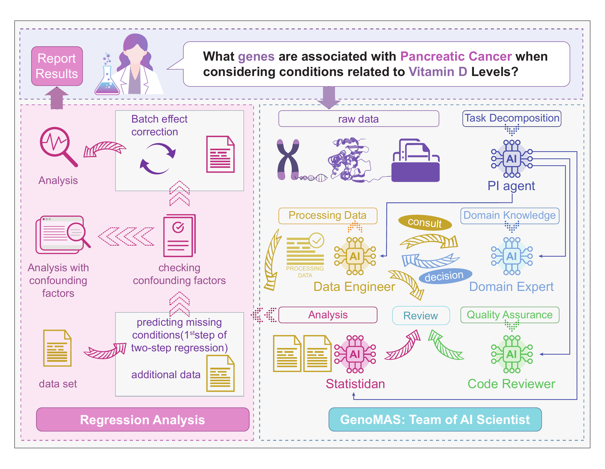
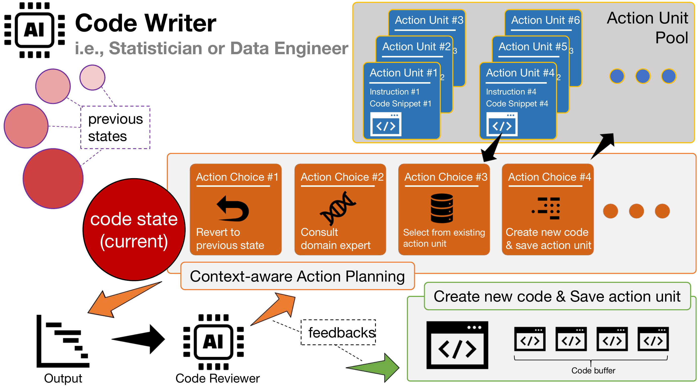
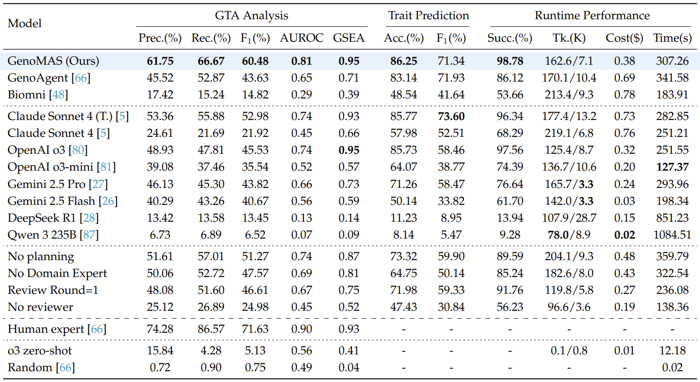
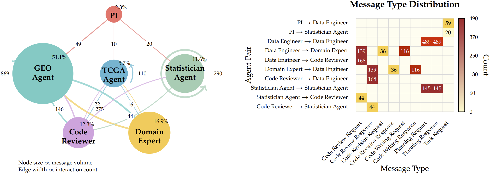

# 让AI科学家真正"可信"：从基因表达分析看智能体自动化的未来

- 论文标题：GenoMAS: A Multi-Agent Framework for Scientific Discovery via Code-Driven Gene Expression Analysis
- arXiv 链接：https://arxiv.org/abs/2507.21035

## 当自动化遇上科学严谨性

大语言模型展现出的代码能力让人印象深刻，但当我们真正想把一项完整的科研任务交给智能体时，会发现问题远比想象中复杂。你可能体验过这样的场景：让Claude或者GPT-4写一段数据分析代码，前几步看起来不错，但随着流程推进，某个看似无关紧要的早期决策会在下游引发连锁反应，导致整个分析在科学意义上完全失效。这种隐蔽的错误往往不会引发程序崩溃，却会让结果变得毫无价值。

我们团队过去一年半的工作，就是围绕这个问题展开的。我们选择了一个具体而有挑战性的切入点：基因表达数据分析，特别是在控制混淆因子后识别基因-表型关联。这个任务的科学价值毋庸置疑——它关系到疾病机制、药物靶点、患者预后等核心问题。但它的难度同样不容小觑：原始数据散落在数百兆的异构文件中，基因命名系统在不断演化，批次效应无处不在，混淆变量层层叠加。要把这样的分析流程完全自动化，智能体不仅要会写代码，还要懂生物学，更要能在犯错后自主纠正。

我们的成果是GenoMAS，一个多智能体协作系统。它在基准测试GenoTEX上达到了60.48%的F1分数和89.13%的数据预处理一致性，比此前最好的方法分别提升了16.85%和10.61%，同时API成本降低近45%。但更重要的是，我们在设计它的过程中，对"什么是可信的科学自动化"这个问题有了更深的认识。

- 图1：GenoMAS的六个智能体角色通过类型化消息协议协作，PI负责调度，两位数据工程师处理GEO和TCGA数据，统计学家执行回归分析，代码审阅者与领域专家提供质量控制。

## 为什么这个任务这么难

这个课题的起步异常艰难。我们最初的想法很直接：既然要评估智能体的性能，就需要有标准答案。于是我们设想建一个基准数据集，收集人类专家按最佳实践完成的高质量分析结果。我们联系了CMU的一位计算生物学教授，希望能把这个任务作为她研究生课程的项目。但当我在视频会议里演示完整个分析流程后，她直接摇头说："这太specialized了，对学生来说难度太大。"

我们只好自己组队来建这个数据集。很快就验证了那位教授的判断——这个任务确实非常专业化。网上能找到的样例代码屈指可数，有用的几个还都是基于R的。我们这些计算机背景的人通过啃书、看网课、请教生物专家来恶补知识，花了很长时间才在本校凑齐一个有足够计算生物背景的团队，把基准数据集搭建起来。

数据集建好后，我们开始测试现有的大模型和智能体。那时还是GPT-4时代，不出所料，没有任何方法能跑通完整流程。后来随着模型能力飞速提升，从Claude Sonnet 4开始，跑通已经不成问题。但我们发现，即使是最先进的智能体，仍然频繁犯一些隐蔽而致命的错误，让整个分析在科学上无效。

这些困难的根源在哪里？首先是数据分布的问题。大模型的能力高度依赖于训练数据中任务的高频性。解数学题、写常规代码这些任务因为互联网上有海量语料而表现优异，但真实世界中那些专业性强、开放性高的任务，大模型往往难以应对。就像一个优秀的应届毕业生到公司后仍需从头培训才能上手，大模型面对这类任务同样需要"入职培训"。

其次是上下文管理的问题。基因表达分析需要从若干个几十到几百兆的文件中整合信息、做出判断。大模型把所有东西都塞进上下文窗口，反而会淹没关键信息。人的工作记忆虽然比上下文窗口小得多，但人会主动探索，会选择性地深加工重要信息。一位熟练的生信专家往往只需在关键节点读几十行关键数据，就能高质量完成整个任务。

## 可信自动化的本质是什么

这些思考让我们重新审视一个根本问题：什么样的科学自动化是"可信"的？

很多人可能认为，只要大模型足够强大，再加上工具使用能力，就能可信地自动进行科研。但我们认为这个观点忽略了科研的一个本质特征：科研没有统一的标准答案。不同学派观点相左，不同实验室对规范的理解存在差异。在执行重要任务时，这些差异会体现在操作细则的方方面面。如果只是向一个"超级智能"丢一句命令，让它按自己的理解去做科研，然后直接把结果端给你——对于严肃的科研工作者来说，这是难以接受的。

所以我们认为，可信的自动化首先要让用户选择自己信任的guidelines。这个guidelines可以简单，也可以复杂，但必须包含足够的信息，让用户确信它体现的科研风格和立场是自己认同的。用户在充分知情的前提下，对结果承担信任和责任。而智能体这一侧，既要确保按照guidelines工作，又要对执行中的各种实际问题灵活处理，避免像硬编码的工作流那样僵化。

换句话说，可信的智能体需要结合workflow的可控性和agent的自主性。这是我们设计GenoMAS的核心理念。

## 把可控的指南和自主的智能体融合起来

沿着这条思路，GenoMAS没有让一个模型包打天下，而是把"该怎么做"先写清楚，再让执行者拥有足够的自主权。

我们把用户认可的分析流程看作一个可编辑的有向无环图（DAG），其中的关键操作被切分为语义自洽、可原子执行的Action Unit。每个Action Unit就像一段可复核的实验步骤，既能被独立审阅，也能在必要时回滚。编程智能体在执行时不会被迫一条路走到黑，而是在每一步做出选择：前进、修订、跳过还是回退。当早期的判断在下游暴露出问题时，系统可以把代码和状态一起拉回到合适的分叉点，从替代路径继续。

系统中的六个角色分工明确、彼此制衡。PI负责统筹调度；两位数据工程师分别处理GEO和TCGA数据的预处理；统计学家负责回归建模和显著基因识别；代码审阅者与领域专家提供质量控制和生物学判断。角色之间通过带类型的消息协议沟通，所有请求和响应都有据可查。

在代码层面，我们坚持"编写—审阅—修订"的闭环。审阅者在隔离上下文中检查代码的可执行性和对指南的遵循，必要时给出明确的否决和修改建议；编程智能体据此整合历史诊断信息完成修订，直到通过或达到上限。涉及生物学语义的节点（如临床特征抽取、基因符号映射）则由领域专家在聚焦上下文中给出判断，并直接以可执行形式落地。

- 图2：单个编程智能体的内部机制。它根据任务上下文规划下一步行动，可以前进、回退、咨询专家或复用已有代码，通过多轮审阅确保质量。

为了应对真实数据的规模和异质性，我们在工程上做了大量工作：并行与断点续跑、缓存与资源监控、超时保护与失败回收。通过"代码记忆"机制，系统把已通过审阅的片段按Action Unit类型索引并重用，在保持稳健的同时逐步积累经验。为了保证可复现性，我们将基因同义词库和基因-表型关联资源本地化并版本化管理。

值得一提的是，我们采用了"异质模型"配置：擅长代码的Claude Sonnet 4承担编程主力，推理能力更强的OpenAI o3主导规划和审阅，在生物知识上表现突出的Gemini 2.5 Pro提供领域判断。这种认知多样性的组织方式，在复杂任务上往往更稳健，也更接近真实的跨学科协作。

## 在GenoTEX基准上的验证

GenoTEX基准提供了一个严苛的测试场景：913个真实数据集、132个表型、共1,384个基因-表型问题，从数据选择、预处理到统计分析全流程评估。这些表型涵盖重大常见疾病、代表性罕见病以及身高、骨密度等身体特征，具有明确的生物学和临床相关性。

结果显示，GenoMAS在数据预处理上达到89.13%的复合相似相关性（CSC），在显著基因识别上达到60.48%的F1，较此前最优方法分别提升10.61%和16.85%；端到端成功率达到98.78%，API成本降低约44.7%。这些数字不只是"更高一些"，而是说明把"可复核指南+自主执行+严格审阅"组织在一起，确实能在真实复杂度面前站稳脚跟。

- 图3：GenoMAS在GenoTEX上的端到端性能对比。F1提升16.85%，AUROC提升0.17，API成本降低约44.7%。

进一步的对照显示，异质模型配置带来了额外收益：相比全部使用Claude Sonnet 4，异质配置的F1提升了7.5%，成本降低了48.9%。这印证了认知多样性在复杂任务中的价值。

有趣的是，我们也测试了Biomni——一个集成了150个生物医学工具的通用智能体。尽管它在工具丰富度上远超GenoMAS，但在我们的任务上F1只有14.82%。这不是因为模型不够强，而是因为基因表达分析强调"按可复核指南执行"和"对边界情形的稳健处理"，而不是开放域下的完全自主。这进一步说明，可信的科学自动化需要的不是更多工具，而是更好的控制机制。

## 瓶颈在哪里

把流程拆开看，我们发现早期误差的"放大效应"最为明显。数据集筛选本身不难，但一旦起步偏离，后续每一步都会为此付出代价。

预处理阶段呈现出鲜明的分化。在表达矩阵处理上，系统稳定达到91.15%的CSC；而在临床特征抽取上，CSC只有32.61%。这是当前的主要瓶颈。难点不在"数值归一化"这样的常规工程，而在于如何把真实世界的临床语义稳稳地落到结构化变量上。

统计分析的对照实验给了我们一个清晰的参照系：当直接使用专家预处理的数据时，系统的F1可达95.26%；若去掉批次效应校正，则显著下降到69.64%。这把"难题的坐标"钉在了恰当的位置——问题不在于选择何种回归模型，而在于能否可靠地处理混淆，尤其是批次效应和协变量控制。

消融实验进一步印证了设计的必要性。去掉情境感知的引导式规划、领域专家或多轮审阅，都会带来明显退化。把审阅轮数限制为一轮，F1从60.48%降至46.61%。"看似笨重"的迭代在长链路中是刚需。此外，我们设置了"零样本、不读数据"的对照，让OpenAI o3直接预测显著基因，AUROC仅0.56，强调了结构化数据处理与领域推理的不可替代性。

- 图4：智能体通信网络与消息类型分布。数据工程师承担多数交互，PI低频调度，规划请求占比最高，体现"引导式规划+多轮审阅"的主轴。

从系统行为看，"代码记忆"在前期迅速爬升至约65%的复用率，节省了可观的时间。消息流量集中在规划与校验，数据工程师主导过半的信息交互，PI仅收发少量消息用于编排，体现了编程智能体的高度自治。这种通信结构本质上是在"集中执行+分布式专长"之间找到平衡。

## 对智能体自动化未来的启示

回到文章开头的问题：怎样让完全自动化的系统在真实科研任务上"值得信任"？

GenoMAS的经验是：不去迷信某个更大或更强的单点突破，而是把可复核的指南、自治的执行与严格的审阅组织在一起，并在真实数据的异质性与边界条件中反复锤炼。

它当然不是终点。临床特征抽取的稳健性、极端数据情形的处理、对指南遵循的进一步可验证化，都还有大量工作要做。我们也在把这一范式推广到更复杂的多组学与多模态场景，结合更强的规划算法与更细粒度的执行追踪，进一步刻画因果与混淆。

但我们想传达的核心观点是：当我们谈论"AI科学家"时，不应该只关注模型有多强，而应该关注如何让它的工作方式变得可信、可控、可复核。先把"如何做事"讲清楚，再让系统在这个框架内自主工作、允许犯错、学会修正，最终用数据说话。这或许是一条更务实、更可持续的路径。

如果你对基因表达分析、多智能体系统或科学自动化感兴趣，欢迎关注我们的工作，也欢迎同行的审视、质疑与合作。
