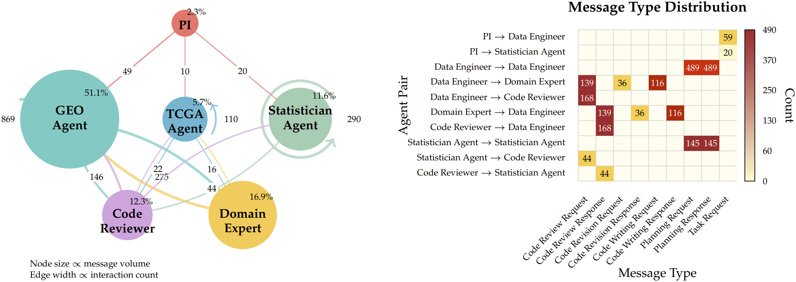

# 当AI学会写代码做科研：一个基因分析智能体的诞生记

- 论文标题：GenoMAS: A Multi-Agent Framework for Scientific Discovery via Code-Driven Gene Expression Analysis
- arXiv 链接：https://arxiv.org/abs/2507.21035

## 写在前面

如果把一份复杂的科研任务完整地交给智能体，让它独自从原始数据一路走到分析结果，我们能放心吗？这不是一个假设性的问题。今天，代码生成能力已经让大模型在许多场景展现出惊人的自动化潜力，但真正的科学计算往往对精确性有着近乎苛刻的要求：一个预处理环节的疏忽，就可能让整篇论文的结论站不住脚；一处混淆因子的遗漏，会把统计显著性变成统计假象。在这样的约束下，智能体能否真正胜任？

我们用一年半的时间，试图在基因表达分析这个具体场景里，给出一个可行的答案。基因表达分析是生物医学研究的基础工具，它能帮我们找到与疾病、药物反应、患者预后相关的关键基因，前提是正确处理海量的转录组数据、应对平台差异与批次效应、控制住年龄性别等混淆变量。这些操作必须通过代码完成，而且每一步都需要领域知识与计算技巧的深度结合。我们构建的 GenoMAS 系统，就是让一组AI智能体学会协作编程，从零开始完成这整条分析链路。

在我们搭建的基准数据集 GenoTEX 上，GenoMAS 达到了 60.48% 的 F1 分数，比此前的最优方法提升了 16.85 个百分点，同时将 API 成本降低了近一半。但比数字更重要的是，我们想分享的是这条路径本身：当我们不再把智能体看作"更聪明的工具调用者"，而是把它们组织成"会写代码的科研团队"时，科学自动化会呈现出怎样的可能性。

## 问题的难度：为什么基因表达分析卡住了智能体

在研发早期，我们遇到的第一个难题不是技术，而是评估标准。如果让智能体去发现某些控制了混淆后的基因-表型关联，而这些关联在文献中尚未被报道，我们怎么知道它做对了？于是我们决定先建一个由人类专家完成的高质量分析结果作为参照。我们找到 CMU 的一位计算生物学教授，提出让她课上的研究生来共同构建这个数据集。她看完任务流程后婉拒了，理由是"太专业化，超出了课程项目的合理难度"。后来我们在校内组了一个团队来做这件事，很快就体会到她说的没错：网上连靠谱的代码样例都不好找，我们这些 CS 背景的人得从头学生物信息学的书和课，还得等很久才凑齐有足够背景的队伍。

基准搭好后，我们开始测试现有的智能体。GPT-4 时代，几乎所有方法都无法跑通完整流程。到了 Claude Sonnet 3.5，代码能跑了，但结果常常在科学上无效：看起来一切正常，实际犯了隐蔽而致命的错误。这类失败植根于大模型的统计本质。首先，它们的能力高度依赖训练数据的覆盖。对于专业性强、互联网语料稀缺的任务——就像一个新员工需要公司内训才能上手的工作——模型往往力不从心。其次，大模型把所有信息一股脑塞进 attention，这在需要从几百兆的文件中有选择地抽取、判断、整合数据时，容易淹没关键信息。而一位熟练的生信专家，会主动探索，会在关键节点定向查阅数据文件的几十行，就能完成整个分析。

这两点差距，决定了智能体设计的方向：我们要给它"入职培训"，让它能在任务中积累经验；也要让它学会探索与选择，而不是被动地处理上下文。探索意味着会犯错，所以还得让它从错误中快速恢复，避免在越来越长的上下文里自我强化错误。

## 可信的科学自动化，到底意味着什么

在着手设计之前，我们必须回答一个更根本的问题：什么样的科学自动化才是"可信"的？很多人相信，只要模型足够强大，智能体足够灵活，就能可信地完成科研工作。但我们认为，即便模型再强，如果完全黑箱化地自主决策，对严肃的科研来说仍然难以接受。原因在于，科学本身没有唯一的标准答案。不同学派有不同立场，不同实验室对操作细则有不同理解，而这些差异在重要任务中不容妥协。如果只是向一个全能智能体丢一句指令，让它自行决定所有细节，用户如何确信这些决定符合自己的科研准则？

因此，可信的科学自动化，首先要让用户选择和审阅自己信任的指南（guideline）。这个指南可以是简单的任务描述，也可以是详尽的方法文档，但它必须包含足够的信息，让用户确认系统将遵循自己认可的科研风格与方法论立场。在此前提下，用户对结果的信任与责任才有基础。而智能体这一侧，则需要既能严格遵循指南，又能在实际执行中灵活应对各种边界情形，避免像传统工作流那样僵化。换句话说，可信的智能体需要把"工作流的可控性"与"智能体的自主性"有机结合。

当然，由于大模型的概率本质，我们无法保证 100% 的遵循。我们能做的，是通过架构设计，在模型指令遵守能力不断进步的基础上，进一步提升可控性。

## 方法设计：让六个角色协作编程

沿着"可信"这条主线，GenoMAS 把任务拆解为两个层次：一层是用户认可的分析指南，它被表达为一个有向无环图（DAG），其中每个节点是一个语义完整的"行动单元"（Action Unit），类似实验步骤中的一个原子操作；另一层是智能体的自主执行，它们在每一步都可以选择前进、修订、跳过或回退，当发现早期决策在下游暴露矛盾时，可以把代码与状态一起拉回到合适的分叉点，从替代路径重新出发。

系统中有六个角色，各司其职。PI 负责统筹调度，根据任务依赖关系动态分配工作，还会并行化处理多个独立的数据集预处理任务。两位数据工程师分别针对 GEO 和 TCGA 两类基因表达数据源，各自掌握平台特有的预处理知识。统计学家负责回归建模、混淆控制与显著基因识别。代码审阅者以隔离上下文的方式检查代码的可执行性与对指南的遵循，必要时给出明确的否决与修改建议。领域专家则在涉及生物学语义的节点（如临床特征抽取、基因符号映射）给出判断，并直接以可执行代码的形式落地。

这六个角色通过带类型的消息协议通信：每条消息都标明发送者、消息类型（如代码审阅请求、审阅响应）、内容与目标角色，所有请求与响应都有据可查。编程智能体在生成代码后，发送审阅请求；审阅者返回通过或拒绝；若拒绝，编程智能体整合历史诊断信息完成修订，如此迭代直到通过或达到上限。值得一提的是，我们采用"异质模型"配置：擅长代码生成的 Claude Sonnet 4 主导编程，推理能力更强的 OpenAI o3 负责规划与审阅，在生物知识上表现突出的 Gemini 2.5 Pro 担任领域专家。这种认知多样性的组合，让系统在复杂任务上更稳健，也更接近真实的跨学科协作。

在工程层面，我们做了许多细节设计以支撑真实任务的运行：并行与断点续跑、缓存与资源监控、超时保护与失败回收。"代码记忆"机制让系统把已通过审阅的代码片段按 Action Unit 类型索引与重用，在保持稳健的同时逐步积累经验。为保证可复现性，我们将基因同义词库与基因-表型关联资源本地化并版本化管理。这些设计共同确保系统既"跑得稳"，也"跑得快"。

## 实验结果：在 GenoTEX 上的全面检验

GenoTEX 基准包含 913 个真实数据集、132 个表型、共 1,384 个基因-表型问题，覆盖了从数据选择、预处理到统计分析的完整流程。表型涵盖重大常见疾病、代表性罕见病以及身高、骨密度等身体特征。评估指标不仅看分数，还看端到端成功率、运行时间与成本，避免"唯指标论"。

在这个严苛的测试场景下，GenoMAS 在数据预处理上达到 89.13% 的复合相似相关系数（CSC），在显著基因识别上达到 60.48% 的 F1，分别比此前最优方法提升 10.61% 和 16.85%；端到端执行成功率 98.78%，API 成本降低约 44.7%。这不仅仅是"数字更高一些"，而是说明"可复核指南 + 自主执行 + 严格审阅"这一组织方式，确实能在真实复杂度面前站稳脚跟。

对照实验显示，异质模型配置带来额外收益：识别能力更强，成本更低。而工具集成更丰富的生物医学智能体 Biomni 在此任务上表现不佳，不是因为"模型不够强"，而是因为任务强调"遵循可复核指南"的受控执行与对边界情形的稳健处理，而非开放域下的完全自主。

## 拆开看：瓶颈在哪里，设计为何有效

把链路拆开分析，早期误差的"放大效应"最为直观：数据集筛选本身不难，但一旦起步偏离，后续每一步都会为此付出代价。预处理阶段呈现鲜明分化：在表达矩阵处理上，系统达到 91.15% 的 CSC，表明它能稳定应对基因组数据的技术复杂性；而在临床特征抽取上，CSC 仅 32.61%，成为当前主要瓶颈。难点不在数值归一化这样的常规工程，而在如何把半结构化的临床文本稳稳地落到结构化变量上。

统计分析的对照实验给了清晰的参照系：当直接使用专家预处理的数据时，GenoMAS 的 F1 可达约 95%；若去掉批次效应校正，则显著下降。这把"难题的坐标"钉在了恰当的位置——问题不在选择何种回归模型，而在能否可靠地控制混淆，尤其是批次效应与协变量。我们在架构层面把"引导式规划—领域判断—多轮审阅"绑在一起，目的就是把这些易被忽略却决定有效性的步骤牢牢嵌入执行链路。

消融实验进一步印证设计的必要性：去掉情境感知的引导式规划、领域专家或多轮审阅，都会带来明显退化；把审阅轮数限为一轮，性能也下降。"看似笨重"的迭代在长链路里却是刚需。此外，"零样本、不读数据"的对照仅达到 0.56 的 AUROC，强调了结构化数据处理与领域推理的不可替代性。

从系统行为看，"代码记忆"在前期迅速爬升至约 65% 的复用率，节省了可观的时间。消息流量集中在规划与校验，PI 低频调度、编程与顾问高频互动的模式与真实跨学科团队相似。在一个代表性的 20 问题会话中，数据工程师角色主导过半的信息交互，统计学家负责分析阶段的关键回合；PI 仅收发少量消息用于编排，体现编程智能体的高度自治。规划请求/响应居首，其次是代码校验；低频的"需要修订"提示说明引导式规划与多轮顾问机制能前置性地防错。

## 往前看：这条路径的意义与局限

回到开篇的问题：怎样让一个完全自动化的系统在科研任务上"值得信任"。GenoMAS 的经验是，不去押注某个更大更强的单点模型，而是把可复核的指南、自治的执行与严格的审阅组织起来，并在真实数据的异质性与边界条件中反复打磨。它当然不是终点：临床特征抽取的稳健性、极端数据情形的处理、对指南遵循的进一步可验证化，都还有大量工作要做。

我们正在把这一范式推广到更复杂的多组学与多模态场景，结合更强的规划算法与更细粒度的执行追踪，进一步刻画因果与混淆，让"可信"从流程合规走向知识层面的可靠。如果说这项工作有更广泛的启示，或许在于：当我们把智能体从"工具调用者"重新定义为"协作编程者"，当我们把"如何做事"先讲清楚再交给它自主执行，科学自动化就不再是遥不可及的愿景，而是一条可以踏实前行的路径。

我们希望继续把这条路走实，也欢迎同行的审视、讨论与合作。
